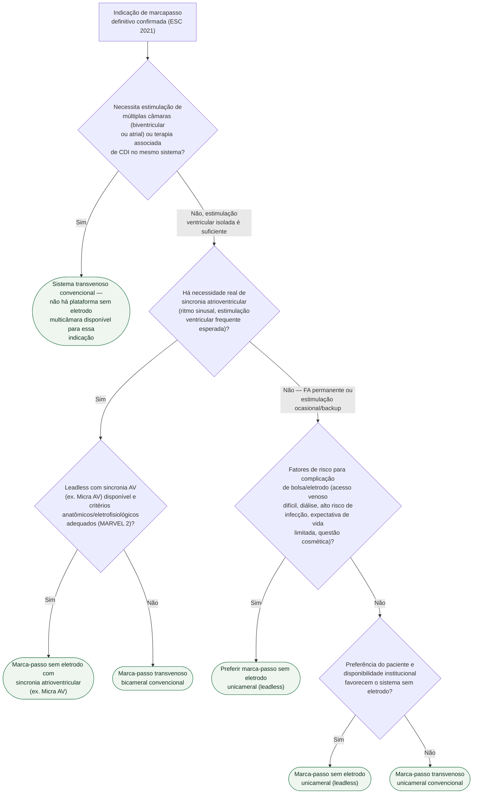

# Fluxograma: Marca-passo transvenoso versus sem eletrodo (leadless)

A discussão sobre marca-passo sem eletrodo só começa depois que a indicação de
estimulação definitiva já está confirmada pela diretriz ESC 2021. A partir
daí, a escolha de plataforma não é preferência de tecnologia — depende de três
perguntas objetivas: se a estimulação exigida é de múltiplas câmaras, se há
necessidade real de sincronia atrioventricular, e se existem fatores que
elevam o risco de complicação de bolsa ou de eletrodo transvenoso.

## Árvore de decisão

## O que a árvore não mostra

**O Micra Transcatheter Pacing Study estabeleceu a segurança do implante e a
ausência de complicação relacionada a bolsa/eletrodo em 96% dos pacientes em
6 meses**, e é essa evidência — não uma preferência tecnológica — que sustenta
o ramo de leadless quando o risco de complicação de bolsa/eletrodo é alto.

**O MARVEL 2 avaliou sincronia AV mecânica, não elétrica**, comparando o
algoritmo de detecção mecânica de contração atrial do Micra AV contra
estimulação assíncrona — a decisão de usar essa plataforma depende de o
paciente manter ritmo sinusal e de haver expectativa real de estimulação
ventricular frequente, não é indicada indistintamente a todo paciente elegível
a marcapasso unicameral.

**Extração de um sistema leadless em caso de infecção ou necessidade de
upgrade** segue via própria, tecnicamente diferente da extração de eletrodo
transvenoso — essa diferença pesa na decisão em paciente jovem com expectativa
de múltiplas trocas ao longo da vida, mas não está representada como ramo
porque é consideração de planejamento de longo prazo, não critério de seleção
inicial.

**RM condicional e compatibilidade de longo prazo** variam por modelo e
geração de dispositivo em ambas as plataformas — checar a ficha técnica do
sistema específico antes do implante, não presumir pela categoria
(transvenoso versus leadless).
