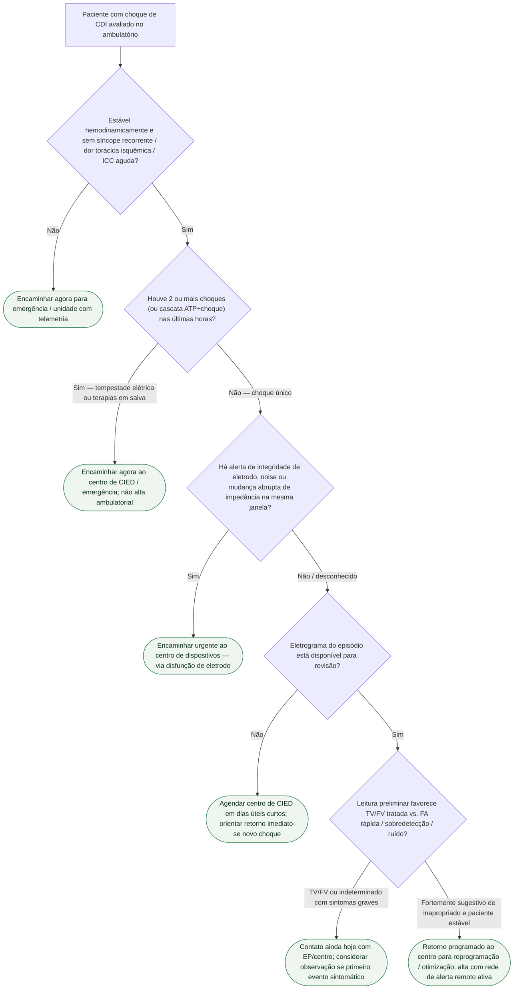

# Fluxograma: pós-choque de CDI no ambulatório — destino

Recorte deliberadamente estreito: **só o destino** após a primeira avaliação ambulatorial. A investigação completa de choque inapropriado e a árvore de disfunção de eletrodo já existem neste tema.

## Árvore de decisão

## O que a árvore não decide

- Diagnóstico definitivo apropriado vs. inapropriado sem EP.
- Se desligar o choque ou indicar colete vestível.
- Antiarrítmico, ablação ou troca de gerador.

Essas decisões ficam com o centro de dispositivos e com os fluxogramas irmãos deste catálogo.

## Lembrete de evidência

Terapia inapropriada não é evento cosmético: MADIT-RIT (PMID 23131066) associou estratégias de programação a menos terapia inapropriada e menor mortalidade em prevenção primária. Por isso o ramo “inapropriado estável” ainda exige **retorno programado**, não alta definitiva sem plano.
