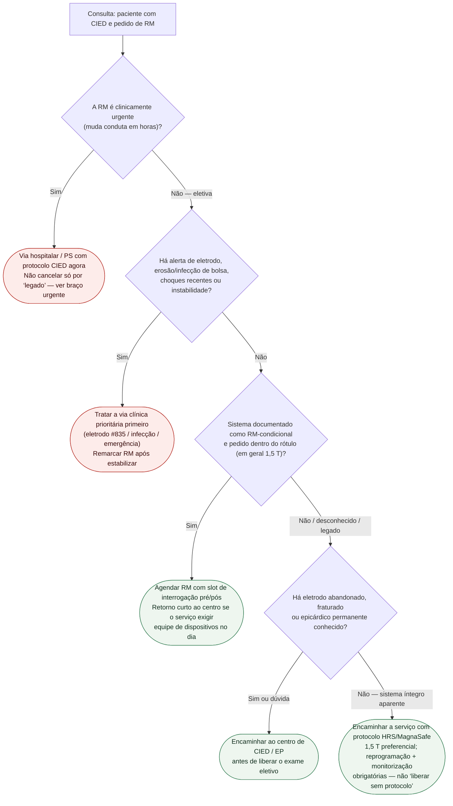

# Fluxograma: pré-RM com CIED no ambulatório — destino

Prosa: [`checklist-ambulatorial-pre-rm-em-portador-de-cied-destino`](checklist-ambulatorial-pre-rm-em-portador-de-cied-destino.md). Braço urgente: [`rm-urgente-em-portador-de-cied-quando-nao-esperar-o-centro`](rm-urgente-em-portador-de-cied-quando-nao-esperar-o-centro.md). Evidência: [`ressonancia-magnetica-em-pacientes-com-marcapasso-ou-cdi-nao-condicional-o-registro-magnasafe`](ressonancia-magnetica-em-pacientes-com-marcapasso-ou-cdi-nao-condicional-o-registro-magnasafe.md).

## Árvore de decisão

## O que a árvore não decide

- Modo de estimulação (DOO/VOO vs ODO) no dia do exame.
- Se desligar ou não terapias de CDI minuto a minuto.
- Se 3 T é aceitável no caso concreto.
- Extração de eletrodo abandonado só para viabilizar RM.

Essas decisões ficam com o centro de dispositivos e com a radiologia sob o consenso HRS (PMID 28502708).

## Lembrete de evidência

Segurança em legado a 1,5 T foi demonstrada **com protocolo** (MagnaSafe PMID 28225684; Nazarian PMID 29281579). O ramo “legado íntegro” ainda exige **serviço preparado**, não alta com “pode fazer RM em qualquer clínica”.
