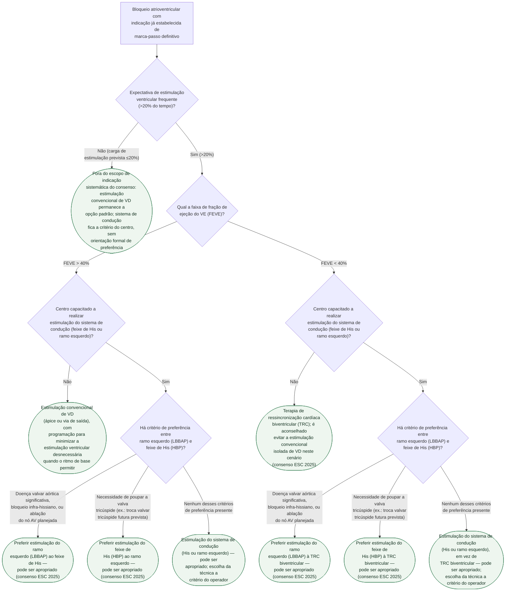

# Fluxograma: Seleção entre marca-passo convencional, estimulação do sistema de condução (His/ramo esquerdo) e TRC no bloqueio atrioventricular

O recorte desta árvore é estreito de propósito: **bloqueio atrioventricular com
indicação já estabelecida de marca-passo definitivo e expectativa de
estimulação ventricular frequente**. A pergunta que ela resolve não é *se*
implantar — isso já está decidido pelo fluxograma de bradiarritmia desta mesma
pasta —, mas **qual via de estimulação usar**: o ápice/via de saída do
ventrículo direito, sempre disponível mas não fisiológica; a estimulação do
sistema de condução (feixe de His ou ramo esquerdo), que preserva a ativação
fisiológica; ou a ressincronização biventricular.

O consenso clínico da ESC de 2025 (Glikson M et al., Europace 2025;27(4):euaf050,
PMID 40159278) é a primeira fonte a formalizar essa escolha, e com uma ressalva
importante sobre como lê-lo: **é um consenso clínico, não uma diretriz formal** —
gradua cada orientação em três categorias próprias (*Advice to do*, *May be
appropriate to do*, *Advice not to do*), não na escala Classe I/IIa/IIb/III com
Nível A/B/C da ESC. A árvore usa "aconselhado"/"pode ser apropriado" para
refletir essa gradação sem inventar Classe onde a fonte não a atribui.

## Árvore de decisão

## O limiar de 20% e o porquê da estratificação por FEVE

O consenso ESC 2025 restringe suas recomendações de estimulação do sistema de
condução a pacientes com **BAV e expectativa de estimulação ventricular
superior a 20%** — abaixo disso, a fonte simplesmente não estende a
recomendação, e a árvore reflete isso encerrando o ramo em conduta padrão sem
atribuir preferência formal.

Acima de 20%, a FEVE separa dois cenários com peso clínico diferente:

- **FEVE > 40%**: a estimulação do sistema de condução **"pode ser
  apropriado"** como alternativa à estimulação convencional de VD — mas a
  fonte não chega a aconselhar evitar o VD convencional nesta faixa de FEVE,
  ao contrário do que faz abaixo de 40%.
- **FEVE < 40%**: a estimulação do sistema de condução **"pode ser
  apropriado" no lugar da TRC biventricular**, e o consenso vai além: inclui
  uma orientação explícita de **"Advice not to do"** — **é aconselhado evitar
  a estimulação convencional de VD** neste cenário. É a única conduta desta
  árvore com orientação negativa formal contra ela.

## Critérios de escolha entre feixe de His e ramo esquerdo

Quando as duas técnicas de estimulação do sistema de condução estão
disponíveis, o consenso orienta a escolha por quatro critérios, todos na
categoria "Advice to do":

- **Ramo esquerdo (LBBAP) preferido ao feixe de His (HBP)** em doença valvar
  aórtica significativa (que pode exigir intervenção futura), bloqueio
  infra-hissiano, ou quando há ablação do nó AV planejada.
- **Feixe de His (HBP) preferido ao ramo esquerdo** quando é necessário poupar
  a valva tricúspide — por exemplo, pela perspectiva de cirurgia ou reparo
  transcateter da tricúspide no futuro.
- **Centros que implantam estimulação do sistema de condução devem,
  idealmente, ser capazes de realizar tanto HBP quanto LBBAP, e também TRC
  biventricular** — é essa orientação que sustenta a TRC como alternativa
  quando o sistema de condução falha ou não está disponível, e não uma
  recomendação isolada de resgate.

## O que a árvore não mostra

**Esta árvore não é sobre a indicação clássica de TRC na insuficiência
cardíaca com bloqueio de ramo esquerdo e FEVE ≤35% em ritmo sinusal** — essa é
outra pergunta clínica, respondida pela diretriz ESC 2021 de estimulação
cardíaca e TRC (Glikson M et al., Eur Heart J 2021;42(35):3427-3520, PMID
34455430) com os cortes de QRS ≥150ms/130-149ms e morfologia LBBB/não-LBBB, já
usada como referência no fluxograma de bradiarritmia publicado nesta pasta.
Aqui a população de partida é o bloqueio atrioventricular com necessidade de
estimulação, não a insuficiência cardíaca com dissincronia elétrica espontânea
— são duas indicações de TRC que partem de portas diferentes e a diretriz de
2021 documenta as duas separadamente.

**O corte exato de FEVE = 40%** não é explicitado pelo consenso como Classe
inclusiva de um lado ou outro (o texto usa "FEVE >40%" e "FEVE <40%" como
categorias próprias, sem declarar o que ocorre exatamente em 40,0%) — na
prática, o valor limítrofe pede julgamento clínico e não está resolvido pela
fonte.

**"Centro capacitado"** não é um critério objetivo definido pelo consenso —
ele recomenda que o centro tenha a capacidade, mas não estabelece volume
mínimo de procedimentos nem curva de aprendizado. A árvore usa essa pergunta
como ramo porque a decisão prática depende diretamente da disponibilidade
local da técnica, não porque a fonte a define com precisão.

**Estimulação em disfunção do nó sinusal isolada** (sem bloqueio
atrioventricular) não está representada aqui — o consenso de 2025 é
específico para BAV, e a disfunção sinusal segue a orientação de modo de
estimulação (DDD com minimização de estimulação ventricular) já detalhada no
fluxograma de bradiarritmia desta pasta.

**Complicação de bolsa, escolha entre marca-passo transvenoso e sem eletrodo
(leadless), e infecção de dispositivo** têm árvores próprias, já publicadas
nesta mesma pasta, e não são repetidas aqui.
