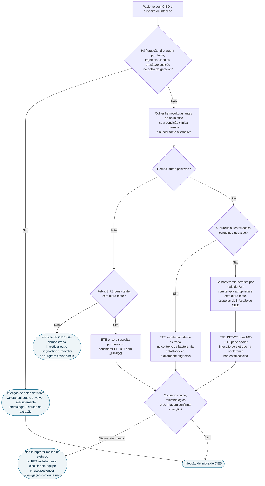
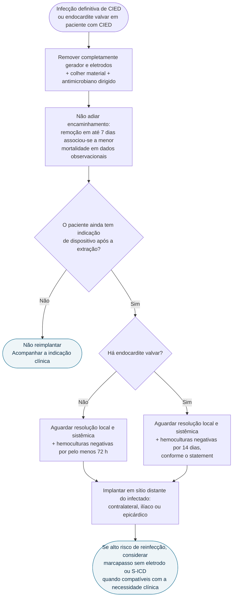

# Fluxograma: suspeita de infecção de CIED (AHA 2023)

Este fluxo começa onde o algoritmo geral de endocardite não basta: **bolsa do gerador, eletrodos e decisão de retirar/reimplantar um CIED**. CIED inclui marcapasso, cardiodesfibrilador implantável e sistemas de ressincronização.

## Da suspeita ao diagnóstico operacional

### Duas cautelas de imagem

- **ETE não é diagnóstico isolado**: ecodensidades em eletrodos podem ser trombos ou material fibrótico; o resultado deve ser integrado a hemoculturas e quadro clínico.
- **PET/CT pode ser falsamente pouco sensível** em infecção discreta de bolsa/eletrodo ou após antibiótico; um exame negativo nessas condições não encerra sozinho a investigação.

## Da infecção definitiva ao reimplante

O benefício associado à extração precoce não define um “prazo seguro” para espera: é evidência observacional e reforça **agilidade**, não autorização para postergar uma remoção já indicada.

## Exceção de alto risco

Quando o risco da remoção supera claramente o benefício, o statement admite supressão antimicrobiana crônica em pacientes selecionados. Isso é exceção individualizada, idealmente decidida por equipe multidisciplinar; não equivale a tratar rotineiramente infecção definitiva apenas com antibiótico.

## Conteúdo CorVIA conectado

- [Orientação AHA, extração precoce e WRAP-IT](/biblioteca/infeccao-de-dispositivo-cardiaco-extracao-de-eletrodo-e-envelope-antibiotico)
- [Infecção de CIED: biofilme, ETE e explante completo](/biblioteca/infeccao-de-cied-espectro-clinico-biofilme-eco-transesofagico-e-necessidade-de-explante-completo)
- [Extração transvenosa de eletrodo](/biblioteca/extracao-de-eletrodo-transvenoso-seguranca-e-o-efeito-do-volume-do-centro)
- [Critérios Duke-ISCVID 2023](/biblioteca/duke-iscvid-2023-criterios-diagnosticos-endocardite-infecciosa)
- [Fluxograma geral de endocardite ESC 2023](/biblioteca/fluxograma-endocardite-infecciosa-esc-2023)

## O que este fluxo não decide

- escolha e duração do antimicrobiano, que dependem de agente, foco, culturas do sistema e presença de endocardite valvar;
- técnica de extração, que depende de anatomia, tempo de implante, carga de eletrodos e experiência do centro;
- necessidade de aspiração de vegetação ou cirurgia valvar;
- reimplante automático: a indicação do dispositivo deve ser reavaliada depois da extração.
