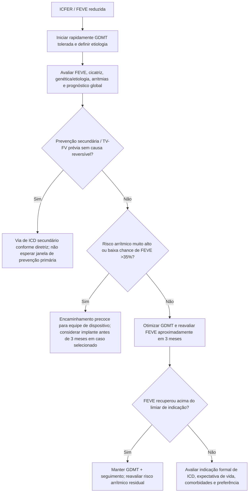
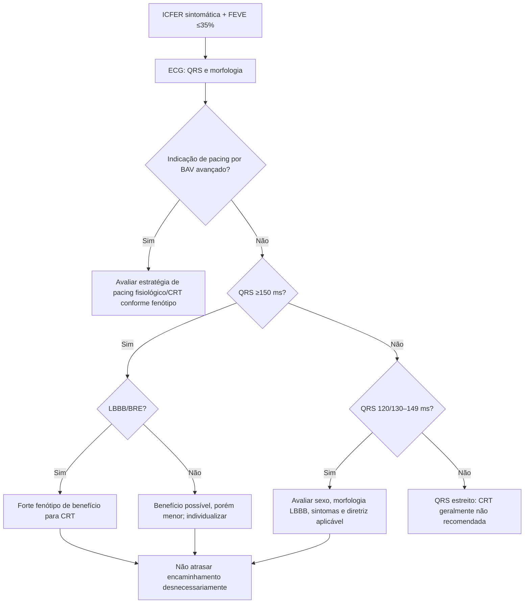

# ICD e CRT na ICFER — consenso europeu 2025

## Problema clínico

A expansão da terapia medicamentosa da ICFER não eliminou o risco de morte súbita nem tornou ICD/CRT obsoletos. O consenso europeu de 2025 enfatiza que fármacos e dispositivos são **terapias complementares**, e que atrasos excessivos no encaminhamento de pacientes elegíveis podem piorar desfechos.

Ao mesmo tempo, parte dos pacientes apresenta recuperação de FEVE após início rápido de GDMT, tornando necessária uma avaliação dinâmica do momento ideal para implante.

## Princípio de timing

A diretriz ESC de IC tradicionalmente considera ICD após aproximadamente **3 meses de GDMT** para permitir possível recuperação da FEVE. O consenso 2025 reforça, porém, que este não deve ser um “relógio rígido”.

Pode fazer sentido encaminhar **antes de 3 meses** quando o risco arrítmico é alto ou a probabilidade de recuperação para FEVE >35% é baixa, por exemplo:

- cardiomiopatia arritmogênica;
- FEVE muito baixa, exemplificada no consenso como **<20%**;
- etiologia irreversível;
- cicatriz miocárdica extensa;
- insuficiência cardíaca avançada com baixa chance de remodelamento suficiente;
- impossibilidade de iniciar/titular GDMT por hipoperfusão ou intolerância, mantendo alto risco de morte súbita.

## Árvore de decisão: ICD na prevenção primária

## CRT: quem deve disparar avaliação precoce

Há amplo consenso entre diretrizes para considerar CRT em paciente com:

- IC sintomática;
- **FEVE ≤35%**;
- terapia médica otimizada/tolerada;
- **QRS ≥150 ms** com benefício mais consistente;
- morfologia de **BRE/LBBB**, que prediz maior resposta;
- recomendações mais fracas em QRS 120/130–149 ms ou morfologia não-BRE.

A maioria das diretrizes recomenda **não usar CRT quando QRS <120/130 ms**.

CRT também é relevante no paciente com IC que necessita estimulação ventricular por bloqueio AV avançado, evitando os efeitos deletérios de estimulação ventricular direita isolada em cenários apropriados.

## Árvore de decisão: CRT

## Um ponto particularmente importante em mulheres

O consenso cita a atualização HRS/APHRS/LAHRS que reconhece maior benefício de CRT em mulheres e inclui recomendação forte para mulheres com:

- FEVE ≤35%;
- ritmo sinusal;
- LBBB;
- QRS **120–149 ms**;
- sintomas NYHA II–IV apesar de GDMT.

Isso ilustra por que um único corte de QRS, sem considerar fenótipo, pode subestimar benefício.

## CRT-P ou CRT-D?

Não existe resposta universal. CRT-D adiciona capacidade de desfibrilação, mas também:

- maior complexidade do sistema;
- risco de choque inadequado;
- complicações de eletrodo;
- infecção e trocas futuras;
- maior custo.

A decisão deve integrar risco de morte súbita versus risco de morte não arrítmica, idade, fragilidade, etiologia, cicatriz, comorbidades, expectativa de vida e preferência do paciente.

## Wearable cardioverter-defibrillator

Pode funcionar como ponte em paciente com risco temporário ou enquanto se aguarda decisão definitiva de ICD, especialmente quando há possibilidade de recuperação de FEVE, mas persiste preocupação significativa com morte súbita.

## Regra prática do consenso

> **Não atrasar encaminhamento além de 3 meses na maioria dos pacientes que continuam claramente elegíveis — e não esperar 3 meses obrigatoriamente quando o risco arrítmico é excepcionalmente alto.**

## Armadilhas

- Não interpretar melhora farmacológica populacional como eliminação do risco individual de morte súbita.
- Não implantar ICD apenas pela FEVE sem revisar etiologia, reversibilidade e prognóstico não arrítmico.
- Não deixar paciente com LBBB largo e ICFER meses em fila de “otimização” quando o próprio CRT pode facilitar melhora hemodinâmica e titulação medicamentosa.
- Não escolher CRT-D automaticamente em todo candidato a CRT.

## Fonte verificada

Bozkurt B, Mullens W, Leclercq C, et al. Cardiac rhythm devices in heart failure with reduced ejection fraction — role, timing, and optimal use in contemporary practice. European Journal of Heart Failure expert consensus document. *Eur J Heart Fail.* 2025;27(7):1242-1261. PMID **40204670**. PMCID **PMC12370598**. DOI **10.1002/ejhf.3641**.

## Status de revisão

`VERIFICAÇÃO HUMANA NECESSÁRIA`: confirmar classe/nível formal das indicações de ICD/CRT na diretriz institucional adotada antes de converter este texto em recomendação normativa.
