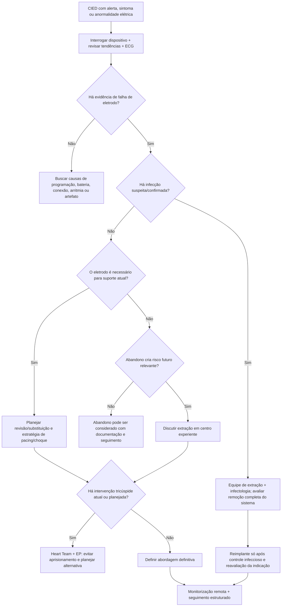

# Manejo de eletrodos de CIED e extração — consenso 2026

A atualização HRS 2026 substitui a visão de que todo problema de eletrodo se resume a "trocar ou extrair" por uma abordagem mais ampla, que incorpora novas tecnologias, risco infeccioso, alternativas sem eletrodo transvenoso, interação com intervenções tricúspides e necessidade de padronização de centros de extração.

O documento contém 108 recomendações e foi construído com revisão sistemática de literatura até dezembro de 2024 e consenso multidisciplinar internacional.

## O que mudou desde 2017

O cenário de dispositivos mudou substancialmente com:

- maior uso de pacing sem eletrodo transvenoso;
- CDI com componentes fora do sistema venoso;
- novos eletrodos de menor calibre/lumenless;
- novas ferramentas de extração;
- crescimento de intervenções transcateter na valva tricúspide;
- maior longevidade dos pacientes e, portanto, maior tempo de exposição a problemas de eletrodo.

## Suspeita de falha de eletrodo

Investigar quando houver:

- aumento abrupto ou progressivo de impedância;
- queda de impedância compatível com falha de isolamento;
- aumento de limiar;
- perda de captura;
- sensing inadequado ou oversensing;
- alertas de integridade;
- choques inapropriados;
- ruído reproduzível ou intermitente;
- discrepância entre dados remotos e interrogatório presencial.

A avaliação deve integrar histórico do dispositivo, tendências, interrogatório, ECG e imagem quando necessária.

## Monitorização remota

O consenso 2026 enfatiza que, quando a tecnologia do sistema permite, **monitorização remota deve fazer parte do manejo rotineiro** porque algoritmos modernos podem detectar alterações elétricas precoces e permitir intervenção antes de falha completa.

Não confundir monitorização remota com garantia de segurança: alerta não interpretado ou fluxo de trabalho sem responsável continua sendo um ponto de falha.

## Infecção muda a decisão

Infecção de CIED é um cenário diferente de falha mecânica isolada. Suspeita de infecção exige avaliar extensão sistêmica, vegetações, bacteremia e envolvimento do pocket; a estratégia de extração deve ser discutida com equipe experiente e suporte infeccioso/cirúrgico conforme o caso.

## Abandonar versus extrair

A decisão deve considerar:

- idade do paciente;
- expectativa de vida;
- número e idade dos eletrodos;
- acesso venoso atual e futuro;
- risco de interação entre eletrodos;
- necessidade provável de MRI/procedimentos futuros;
- presença de infecção;
- experiência do centro;
- alternativas como sistema leadless ou subcutâneo/extravascular.

Não existe uma regra universal de "eletrodo velho = extrair".

## Intervenção tricúspide

A expansão de substituição/reparo transcateter tricúspide trouxe um novo problema: eletrodos transvalvares podem interferir no procedimento ou ser aprisionados pela prótese. Planejamento deve ocorrer antes da intervenção, com Heart Team + eletrofisiologia para decidir necessidade de extração, reposicionamento ou estratégia de pacing alternativa.

## Árvore de decisão — problema de eletrodo de CIED

## Quando encaminhar para centro de extração especializado

- infecção sistêmica relacionada ao dispositivo;
- múltiplos eletrodos ou longa permanência;
- acesso venoso complexo;
- interação com prótese/intervenção tricúspide;
- eletrodo fraturado com complicações;
- necessidade de extração em paciente dependente de marcapasso;
- anatomia ou comorbidades que elevem risco procedimental.

## Armadilhas

- Extrair eletrodo apenas pela idade cronológica do cabo.
- Abandonar sucessivamente eletrodos sem planejar o acesso venoso futuro.
- Interpretar ruído como taquiarritmia verdadeira e programar terapias inadequadas.
- Realizar intervenção tricúspide sem discutir previamente os eletrodos transvalvares.
- Tratar infecção de pocket com antibiótico isolado sem avaliar o sistema completo.
- Manter monitorização remota sem fluxo institucional claro para responder a alertas.

## Regra prática

**Falha de eletrodo exige duas decisões separadas:** primeiro confirmar o mecanismo; depois decidir abandonar, revisar ou extrair. Infecção, acesso venoso e intervenções tricúspides podem mudar completamente a escolha.