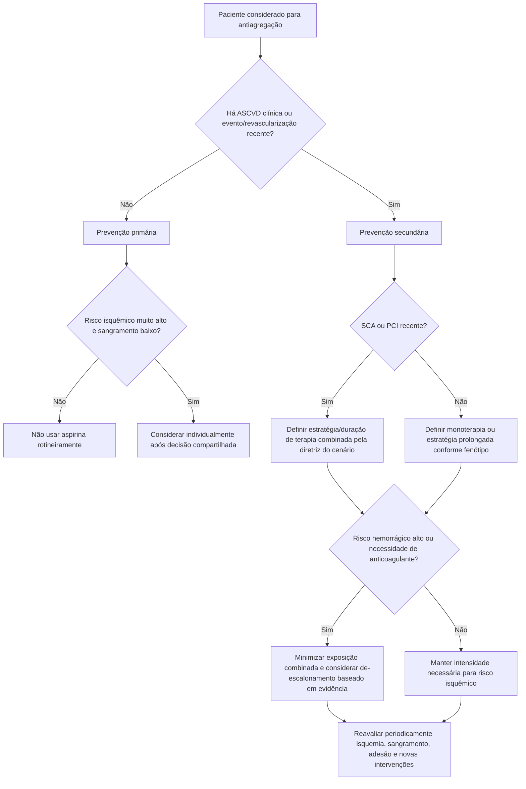

# ACC 2026 — antiagregação na ASCVD

O Scientific Statement do ACC publicado em junho de 2026 sintetiza a evolução da terapia antiagregante na doença cardiovascular aterosclerótica (ASCVD). A mensagem central é simples: **quanto maior o benefício isquêmico esperado, mais justificável a intensidade/duração da antiagregação; quanto maior o risco hemorrágico, mais importante minimizar exposição desnecessária**.

## 1. Aspirina em prevenção primária

O statement reforça que dados atuais **não sustentam aspirina rotineira para prevenção primária em populações não selecionadas**. Consideração deve ficar restrita a pessoas com risco isquêmico suficientemente alto e risco de sangramento baixo, após avaliação individualizada.

Portanto, idade ou presença isolada de um fator de risco não devem disparar aspirina automaticamente.

## 2. ASCVD estabelecida

Em doença aterosclerótica clínica, antiagregantes continuam sendo ferramentas fundamentais para prevenção secundária. A estratégia depende do fenótipo:

- SCA recente;
- PCI/stent;
- doença coronariana crônica estável;
- DAP;
- AVC/AIT aterotrombótico;
- necessidade concomitante de anticoagulação.

O statement compara e harmoniza recomendações atuais ACC/AHA e ESC, reconhecendo que duração de DAPT e transição para monoterapia variam conforme cenário, risco isquêmico, sangramento e tipo de intervenção.

## 3. O eixo decisório é isquemia versus sangramento

### Elementos que aumentam preocupação isquêmica

- SCA recente;
- eventos recorrentes;
- anatomia coronariana complexa;
- PCI complexa ou história de trombose de stent;
- doença aterosclerótica multiterritorial;
- diabetes e outros marcadores de risco, conforme contexto.

### Elementos que aumentam preocupação hemorrágica

- sangramento prévio;
- anemia/trombocitopenia;
- idade/fraqueza clínica;
- doença renal ou hepática;
- necessidade concomitante de anticoagulação;
- polifarmácia/interações;
- cirurgia ou procedimento invasivo próximo.

Não existe um único escore que substitua essa integração em todos os cenários.

## 4. Paciente que também precisa de anticoagulação

Quando existe indicação de anticoagulante, somar antiagregantes aumenta sangramento. Por isso, o statement enfatiza limitar terapia combinada à indicação e duração realmente necessárias, usando evidência específica do cenário (por exemplo, FA + PCI) e reavaliando repetidamente a necessidade do antiagregante.

## 5. Cirurgia e procedimentos

O manejo perioperatório deve considerar simultaneamente:

- motivo do antiagregante;
- tempo desde SCA/PCI;
- risco de trombose de stent;
- risco hemorrágico da cirurgia;
- possibilidade de manter ao menos parte da terapia;
- urgência do procedimento.

Não deve haver suspensão automática de antiagregante apenas porque uma cirurgia foi marcada.

## 6. Adesão é parte do tratamento

O statement destaca fatores associados à não adesão:

- idade avançada;
- polifarmácia;
- barreiras socioeconômicas;
- custo;
- sangramento;
- dispneia ou outros efeitos adversos.

Estratégias úteis incluem retorno precoce após alta, educação culturalmente apropriada, redução de barreiras financeiras, vigilância de efeitos adversos e de-escalonamento quando clinicamente indicado.

## Árvore de decisão — escolher estratégia antiagregante

## O que NÃO fazer

- Prescrever aspirina para todo diabético sem ASCVD apenas por prevenção primária.
- Manter DAPT indefinidamente sem reavaliar benefício absoluto e sangramento.
- Associar anticoagulante + antiagregantes sem indicação clara e revisão de duração.
- Suspender antiagregante automaticamente antes de cirurgia sem considerar tempo do stent/SCA.
- Interpretar sangramento menor recorrente como problema de adesão sem investigar causa e possibilidade de ajuste.
- Usar “alto risco isquêmico” como justificativa vaga sem documentar os fatores reais.

## Regra prática

**A estratégia antiagregante não é fixa para a vida inteira.** Ela deve acompanhar a fase da doença: evento agudo e PCI elevam necessidade anti-isquêmica; com o passar do tempo, o peso relativo do sangramento aumenta e a terapia deve ser reavaliada.