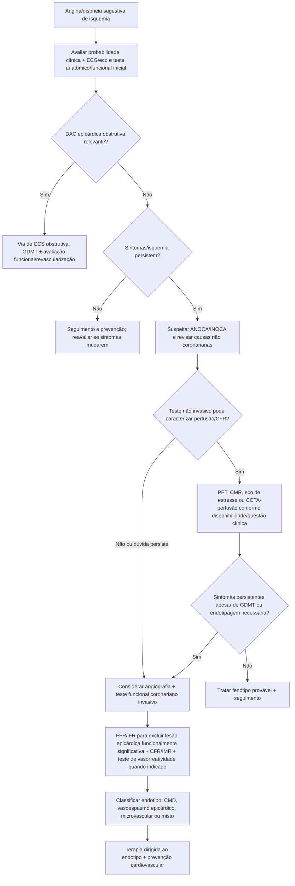
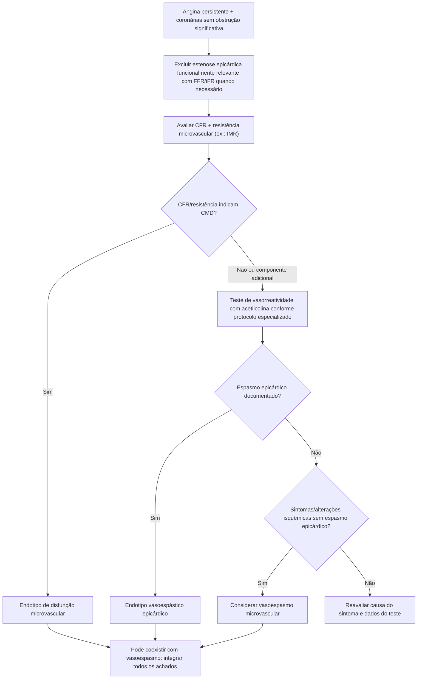

# ANOCA/INOCA — ESC 2024

## Por que artéria “sem obstrução” não encerra a investigação

A diretriz ESC 2024 de síndrome coronariana crônica reconhece que angina/isquemia pode resultar de alterações funcionais e estruturais da circulação coronária mesmo sem estenose epicárdica obstrutiva. Isso inclui:

- disfunção microvascular coronariana (CMD);
- angina microvascular;
- vasoespasmo epicárdico;
- vasoespasmo microvascular;
- combinações desses endotipos.

A diretriz destaca que ANOCA/INOCA está associada a pior qualidade de vida, uso frequente de recursos de saúde e aumento de morbidade/eventos cardiovasculares; portanto, não deve ser descartada como “dor não cardíaca” apenas porque CCTA/angiografia não mostrou obstrução relevante.

## Conceitos

- **ANOCA:** angina com coronárias não obstrutivas.
- **INOCA:** isquemia documentada com coronárias não obstrutivas.

Mulheres são particularmente representadas entre pacientes com disfunção microvascular e vasoespasmo.

## Árvore diagnóstica

## Testes não invasivos

A ESC 2024 descreve métodos capazes de avaliar perfusão/reserva de fluxo, entre eles:

- PET;
- CMR de perfusão;
- ecocardiografia de estresse em cenários apropriados;
- CCTA associada a perfusão em centros com expertise.

PET tem papel particularmente útil quando é necessária quantificação absoluta de fluxo sanguíneo miocárdico.

Nenhuma técnica não invasiva visualiza diretamente a microcirculação humana; resultados devem ser interpretados depois de excluir DAC epicárdica obstrutiva relevante.

## Teste funcional coronariano invasivo

Quando a angiografia/avaliação de pressão coronariana não mostra doença epicárdica significativa e existe suspeita persistente de ANOCA/INOCA, a ESC descreve investigação funcional invasiva que pode incluir:

- **CFR** — reserva de fluxo coronariano;
- **IMR** — índice de resistência microcirculatória;
- teste de vasorreatividade com **acetilcolina** (ou ergonovina em protocolos apropriados);
- FFR/iFR para lesões epicárdicas intermediárias.

A diretriz é especialmente enfática no paciente **persistentemente sintomático apesar de GDMT**: a endotipagem invasiva deve ser realizada para identificar o mecanismo e direcionar tratamento.

## Árvore de endotipagem invasiva

## Por que a endotipagem importa

A terapia antianginosa não deve ser escolhida de forma completamente empírica quando o mecanismo pode ser demonstrado. Vasoespasmo e disfunção microvascular têm fisiopatologia diferente e podem responder a estratégias distintas.

Além da terapia antianginosa, pacientes com ANOCA/INOCA continuam necessitando manejo rigoroso de:

- pressão arterial;
- lipídios;
- tabagismo;
- diabetes;
- peso/atividade física;
- aterosclerose não obstrutiva quando presente.

## Probabilidade clínica e decisão de testar

A ESC 2024 incorporou fatores de risco à estimativa de probabilidade de DAC obstrutiva. Pacientes com probabilidade pré-teste **muito baixa (≤5%)** podem ser candidatos a não realizar investigação diagnóstica rotineira para obstrução, após julgamento clínico.

No extremo oposto, angiografia invasiva é indicada em cenários como probabilidade muito alta de DAC obstrutiva, sintomas graves/refratários, angina ou dispneia em baixo nível de esforço ou alto risco de eventos.

## Armadilhas

1. Não encerrar caso sintomático como “coronárias normais” depois de angiografia sem estenose.
2. Não chamar todo ANOCA de espasmo: CMD e fenótipos mistos são frequentes.
3. Não usar FFR normal para excluir doença microvascular.
4. Não submeter todos os pacientes a teste invasivo; a indicação depende de sintomas, probabilidade, testes prévios e consequência clínica.
5. Não esquecer prevenção aterosclerótica porque não existe lesão obstrutiva.

## Fonte verificada

Vrints C, Andreotti F, Koskinas KC, et al. 2024 ESC Guidelines for the management of chronic coronary syndromes. *Eur Heart J.* 2024;45(36):3415-3537. PMID **39210710**. DOI **10.1093/eurheartj/ehae177**.

## Status de revisão

`VERIFICAÇÃO HUMANA NECESSÁRIA`: antes de incorporar doses/concentrações do protocolo de acetilcolina ou thresholds de CFR/IMR em calculadora/fluxo assistencial, auditar a Recommendation Table e o protocolo técnico completos da diretriz/consenso adotado pelo serviço.
