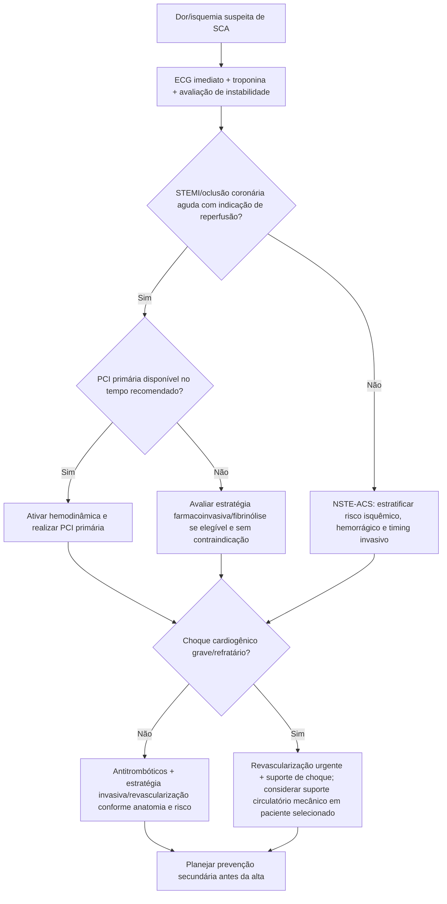
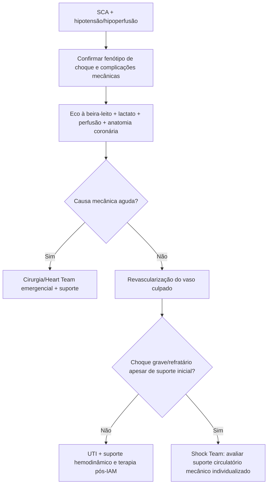

# Síndrome coronariana aguda — ACC/AHA 2025

## O que esta diretriz substitui

A diretriz ACC/AHA/ACEP/NAEMSP/SCAI de 2025 consolida e atualiza a abordagem norte-americana de STEMI e NSTE-ACS, incorporando evidências modernas de reperfusão, antiagregação, choque cardiogênico, imagem intravascular e estratégia de revascularização.

## Árvore de decisão inicial

## STEMI: tempo continua sendo miocárdio

Para STEMI com apresentação <12 horas do início dos sintomas, a diretriz mantém **PCI primária como método preferido de reperfusão** quando pode ser realizada em tempo apropriado.

Metas citadas na literatura de implementação da própria diretriz:

- primeiro contato médico → dispositivo **≤90 min** quando o paciente chega a centro com PCI;
- **≤120 min** quando necessita transferência inter-hospitalar.

Esses tempos são objetivos de sistema; não devem atrasar reperfusão em cenários nos quais estratégia alternativa é claramente necessária.

## Antiagregação: pontos contemporâneos

No paciente tratado com PCI, a diretriz 2025 favorece inibidores P2Y12 mais potentes em relação ao clopidogrel quando não há contraindicação clínica relevante.

A literatura latino-americana que discute a diretriz destaca:

- **prasugrel** como opção preferida no contexto de PCI em pacientes elegíveis;
- **ticagrelor** preferido a clopidogrel em SCA, independentemente de estratégia invasiva em cenários apropriados;
- pré-tratamento antes da anatomia **não deve ser automático**; quando angiografia invasiva será muito tardia, a decisão pode ser diferente e precisa integrar risco isquêmico e hemorrágico.

> Doses não são repetidas aqui porque já existem módulos farmacológicos dedicados no sistema. Sempre usar o protocolo específico de antiagregação.

## Imagem intravascular

A diretriz 2025 elevou o uso de **imagem intravascular para PCI complexa** a recomendação forte. IVUS/OCT podem ajudar a:

- definir anatomia e tamanho do vaso;
- caracterizar calcificação;
- otimizar expansão do stent;
- identificar malaposição, dissecção de borda e mecanismos de falha do stent.

## Choque cardiogênico

### Regra 1 — revascularizar o culpado

Em SCA com choque cardiogênico, reperfusão/revascularização urgente permanece central.

### Regra 2 — suporte mecânico não é sinônimo de “qualquer dispositivo para qualquer choque”

A diretriz 2025 passou a considerar **bomba de fluxo microaxial** razoável em pacientes selecionados com STEMI e choque grave/refratário, com base em evidência randomizada contemporânea.

Ao mesmo tempo, o uso rotineiro de **balão intra-aórtico** sem indicação específica foi rebaixado; não deve ser usado automaticamente apenas porque o paciente está em choque.

## Árvore: choque em SCA

## Antes da alta: não encerrar o caso na PCI

A estratégia pós-SCA deve incorporar:

- terapia antitrombótica com duração individualizada por risco isquêmico/hemorrágico;
- redução intensiva de LDL;
- avaliação da FEVE;
- tratamento de IC quando presente;
- cessação do tabagismo;
- reabilitação cardiovascular;
- plano de seguimento e adesão.

## Armadilhas

- Não atrasar reperfusão esperando exames que não mudarão a decisão em STEMI típico.
- Não confundir “imagem intravascular recomendada em PCI complexa” com obrigação de OCT/IVUS em toda angioplastia simples.
- Não usar suporte mecânico sem fenotipar choque e sem plano de saída.
- Não deixar a prevenção secundária para a primeira consulta ambulatorial: ela começa ainda na internação.

## Fontes verificadas

1. Rao SV, O'Donoghue ML, Ruel M, et al. 2025 ACC/AHA/ACEP/NAEMSP/SCAI Guideline for the Management of Patients With Acute Coronary Syndromes. *Circulation.* 2025;151(13):e771-e862. PMID **40014670**. DOI **10.1161/CIR.0000000000001309**.
2. Furtado RHM, Rochitte CE, Nicolau JC, et al. American College of Cardiology/American Heart Association Acute Coronary Syndrome Guidelines: A Latin American Perspective. *J Am Coll Cardiol.* 2025;85(22):2122-2125. DOI **10.1016/j.jacc.2025.04.037**.

## Status de revisão

`VERIFICAÇÃO HUMANA NECESSÁRIA`: conferir no texto integral da diretriz a classe e nível de evidência de cada recomendação antes de convertê-las em itens formais de Evidências.
