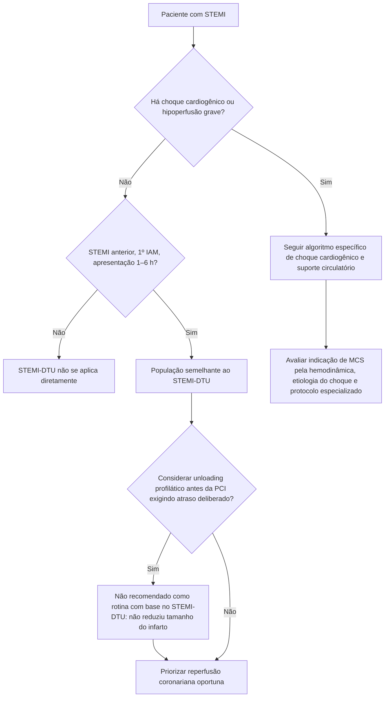

# STEMI-DTU 2026

O **STEMI Door-to-Unload (STEMI-DTU)** testou uma hipótese fisiologicamente atraente: descarregar o ventrículo esquerdo com uma microbomba axial transvalvar antes de abrir a artéria coronária poderia reduzir trabalho miocárdico, atenuar lesão de reperfusão e diminuir o tamanho final do infarto.

O ensaio randomizado de 2026 mostrou que, no cenário estudado, essa estratégia **não melhorou o desfecho primário** e prolongou o tempo total de isquemia.

## População

Foram randomizados **527 pacientes**:

- **262** para unloading ventricular com bomba axial transvalvar por **30 minutos antes da PCI**;
- **265** para PCI imediata sem unloading prévio.

Critérios centrais:

- idade de 18 a 85 anos;
- primeiro infarto;
- STEMI anterior;
- apresentação entre **1 e 6 horas** do início dos sintomas;
- **ausência de choque cardiogênico**.

A idade média foi **61 ± 11 anos**, e 79,1% eram homens.

## Desfecho primário

O tamanho do infarto foi medido por ressonância cardíaca **3–5 dias** após a PCI e normalizado pela massa do ventrículo esquerdo.

Resultado:

- unloading + atraso da PCI: **30,8% ± 16,2%**;
- PCI imediata: **31,9% ± 16,9%**;
- diferença média **−1,1 ponto percentual**;
- IC95% **−4,2 a 2,0**;
- **P=0,50**.

Portanto, não houve redução significativa do tamanho do infarto.

## Custo fisiológico e procedimental da estratégia

O tempo total de isquemia foi maior no grupo submetido a unloading antes da reperfusão.

Além disso, **sangramento maior ou complicações vasculares em 30 dias foram mais frequentes no grupo de unloading**, tanto em comparação ao objetivo de desempenho pré-especificado quanto ao grupo controle. O abstract publicado não fornece, sozinho, todos os percentuais individuais desses eventos; portanto, números adicionais não são reproduzidos aqui sem conferência do texto/tabela completa.

## O que o ensaio responde

O STEMI-DTU testa especificamente se **adiar deliberadamente a reperfusão por 30 minutos para realizar unloading** melhora o tamanho do infarto em STEMI anterior sem choque.

A resposta foi negativa.

Isso reforça que, nesse fenótipo, a prioridade continua sendo **reperfusão coronariana oportuna**, e não criar um atraso sistemático para unloading profilático.

## O que o ensaio NÃO responde

O resultado **não deve ser extrapolado** para:

- STEMI com choque cardiogênico;
- suporte mecânico indicado por colapso hemodinâmico;
- complicações mecânicas do IAM;
- outros dispositivos de suporte circulatório;
- uso de unloading sem atraso deliberado de reperfusão;
- infarto não anterior.

Choque cardiogênico é uma população fisiologicamente e prognosticamente diferente.

## Árvore de decisão — unloading no STEMI

## Leitura metodológica

Um resultado negativo aqui é clinicamente valioso porque a estratégia possuía forte racional mecanístico. O ensaio demonstra que **melhorar um marcador fisiológico ou descarregar o VE antes da reperfusão não garante redução do dano miocárdico final**, sobretudo quando a intervenção exige prolongar a isquemia coronariana.

## Armadilhas

- Aplicar o resultado a pacientes em choque cardiogênico.
- Concluir que qualquer suporte mecânico em STEMI é inútil.
- Ignorar o aumento do tempo total de isquemia introduzido pelo protocolo.
- Focar apenas na diferença numérica de −1,1 ponto percentual e ignorar o IC95% e P=0,50.
- Usar números de complicação vascular de fontes secundárias quando o abstract primário não os detalha.

## Regra prática

**No STEMI anterior sem choque, não atrasar a PCI apenas para realizar unloading ventricular profilático.** O STEMI-DTU não demonstrou redução do tamanho do infarto e reforça a prioridade da reperfusão rápida.