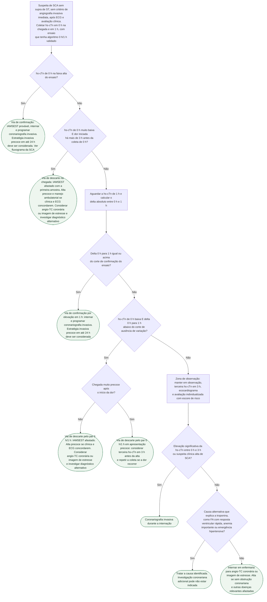

# Fluxograma: Algoritmo 0/1 h de troponina de alta sensibilidade na suspeita de SCA sem supra (ESC 2023)

O fluxograma geral da SCA nesta pasta (ver fluxograma-sindrome-coronariana-aguda-esc-2023) trata o algoritmo de troponina como uma única caixa com três saídas. Este fluxograma abre essa caixa. A ESC 2023 recomenda os algoritmos 0 h/1 h (primeira opção) ou 0 h/2 h (segunda opção) com troponina de alta sensibilidade (hs-cTn) para confirmar ou descartar IAMSEST (Classe I, nível B), com a coleta de 0 h feita imediatamente na chegada e resultado disponível em até 60 minutos. O que a árvore decide é: quem sai do algoritmo com o infarto afastado logo na primeira amostra, quem sai com o par 0 h/1 h, quem entra na via de confirmação e o que fazer com quem fica na zona de observação — que não é "resultado indeterminado", é um grupo com mortalidade semelhante à da via de confirmação e que exige a terceira dosagem em 3 h.

Os cortes numéricos são específicos de cada ensaio e não são intercambiáveis. Por isso os ramos abaixo falam em "muito baixa", "baixa", "alta" e "delta"; os valores de cada plataforma estão na tabela da prosa, nunca nos ramos. O algoritmo só vale para ensaio validado; sem um deles, é preciso outra estratégia.

## Árvore de decisão

## Antes de entrar no algoritmo

O algoritmo é para quem já teve STEMI e SCA sem supra de risco muito alto excluídos pelo ECG e pela clínica, com suspeita de SCA. Não se aplica a população indiferenciada do pronto-socorro (sepse, AVC), e nunca substitui a avaliação da dor e do ECG de 12 derivações: dor persistente ou recorrente exige nova coleta, e padrão de angina em crescendo ou instável pede investigação mesmo com troponina baixa. A triagem de dor torácica anterior a este ponto está em protocolo-de-dor-toracica-na-emergencia-escore-heart-e-tempo-porta-ecg-sbc-2025 e fluxograma-heart-dor-toracica-pronto-socorro.

A diretriz orienta colher 0 h e 1 h de forma sistemática, sem esperar o resultado da primeira: o horário da coleta de 0 h define a janela de 1 h (mais ou menos 10 minutos). Se a coleta de 1 h não foi possível, colhe-se em 2 h e aplica-se o algoritmo 0 h/2 h, se validado para o ensaio. O algoritmo 0 h/3 h fica como alternativa quando nenhum dos dois é viável; três grandes estudos diagnósticos o mostraram menos eficaz e menos seguro que os protocolos rápidos.

## Via de descarte: duas portas de saída

A primeira porta é a hs-cTn de 0 h muito baixa em paciente cuja dor começou há mais de 3 h antes da coleta; aqui o IAMSEST é descartado com uma única amostra. A segunda porta é a combinação de 0 h baixa com delta de 1 h abaixo do corte de ausência de variação. Nas coortes de validação, o valor preditivo negativo para infarto na via de descarte foi acima de 99%, e os pacientes descartados pelos algoritmos 0 h/1 h ou 0 h/2 h tiveram taxa muito baixa de eventos em 30 dias.

Os algoritmos valem independentemente do horário de início da dor, e a segurança se manteve no subgrupo de apresentação muito precoce. Ainda assim, pela dependência temporal da liberação de troponina e pelo número moderado de pacientes que chegaram com menos de 1 h de dor nos estudos, a diretriz diz que uma dosagem adicional em 3 h deve ser considerada nos que chegam precocemente e foram triados para descarte. O ramo D5 não fixa um número de horas: o material suplementar cita "por exemplo, menos de 2 h" como apresentação muito precoce. Elevações tardias ocorrem em cerca de 1% dos pacientes, o que justifica repetir a coleta se a suspeita clínica persistir ou a dor recorrer.

Descarte não significa automaticamente alta. Combinado com clínica e ECG, o algoritmo identifica candidatos a alta precoce e manejo ambulatorial; conforme a estratificação, exame de imagem eletivo, invasivo ou não, pode estar indicado mesmo após afastar o infarto, para chegar ao diagnóstico alternativo. Em pacientes com suspeita de SCA, hs-cTn não elevada ou incerta, sem alteração de ECG e sem dor recorrente, angio-TC coronária ou imagem de estresse não invasiva deve ser considerada como parte da investigação inicial (Classe IIa, nível A); angio-TC precoce de rotina para toda suspeita de SCA não é recomendada (Classe III, nível B).

## Via de confirmação

Entra na via de confirmação quem tem hs-cTn de 0 h pelo menos moderadamente elevada (faixa alta do ensaio) ou elevação clara na primeira hora (delta de 1 h igual ou acima do corte). O valor preditivo positivo para infarto foi de aproximadamente 70 a 75% nos estudos; a maioria dos pacientes confirmados sem infarto tinha outra doença que exige atenção cardiológica, e por isso a grande maioria dessa via precisa de internação e coronariografia invasiva. O IAMSEST confirmado pelos algoritmos de hs-cTn é um dos critérios de alto risco pelos quais a estratégia invasiva precoce, em até 24 h, deve ser considerada (Classe IIa, nível A), ao lado de alteração dinâmica de ST/T, supra transitório de ST e GRACE acima de 140 — detalhado em sindrome-coronariana-aguda-timing-invasivo-e-dapt-esc-2023 e sindrome-coronariana-aguda-estratificacao-de-risco-grace-complemento-numerico.

## Zona de observação

Quem não preenche nem descarte nem confirmação fica em observação. É um grupo heterogêneo, com mortalidade semelhante à da via de confirmação, e a diretriz recomenda avaliação individualizada com escore de risco e uma terceira dosagem de troponina em 3 h, com ecocardiograma, como próximo passo (a dosagem adicional após 3 h quando as duas primeiras não são conclusivas e não há diagnóstico alternativo é Classe I, nível B). A maioria dos observados com suspeita clínica alta de SCA, por exemplo com elevação significativa da troponina entre 0 h e 3 h, é candidata a coronariografia invasiva. Os de probabilidade baixa a intermediária são candidatos a imagem não invasiva após saírem da emergência: angio-TC coronária identifica quem não tem obstrução e pode receber alta depois de afastadas outras doenças relevantes, e quem tem doença obstrutiva para eventual revascularização; ressonância com estresse, SPECT ou eco de estresse são alternativas conforme a experiência do centro. Quando há entidade alternativa que explica a troponina — FA com resposta ventricular rápida, anemia importante, emergência hipertensiva —, investigação adicional como coronariografia pode não estar indicada.

Para o ensaio hs-cTnT Elecsys, foram derivados e validados cortes específicos para a zona de observação: concentração em 3 h abaixo de 15 ng/L e variação absoluta 0 h/3 h abaixo de 4 ng/L, com segurança e eficácia aceitáveis; para os ensaios de hs-cTnI esses cortes ainda estão em desenvolvimento.

## Cortes por ensaio (Tabela S4 da ESC 2023, em ng/L)

Algoritmo 0 h/1 h:

| Ensaio | Muito baixa | Baixa | Sem delta 1 h | Alta | Delta 1 h |
|---|---|---|---|---|---|
| hs-cTnT Elecsys, Roche | < 5 | < 12 | < 3 | ≥ 52 | ≥ 5 |
| hs-cTnI Architect, Abbott | < 4 | < 5 | < 2 | ≥ 64 | ≥ 6 |
| hs-cTnI Centaur, Siemens | < 3 | < 6 | < 3 | ≥ 120 | ≥ 12 |
| hs-cTnI Access, Beckman Coulter | < 4 | < 5 | < 4 | ≥ 50 | ≥ 15 |
| hs-cTnI Clarity, Singulex | < 1 | < 2 | < 1 | ≥ 30 | ≥ 6 |
| hs-cTnI Vitros, Clinical Diagnostics | < 1 | < 2 | < 1 | ≥ 40 | ≥ 4 |
| hs-cTnI Pathfast, LSI Medience | < 3 | < 4 | < 3 | ≥ 90 | ≥ 20 |
| hs-cTnI TriageTrue, Quidel | < 4 | < 5 | < 3 | ≥ 60 | ≥ 8 |
| hs-cTnI Dimension EXL, Siemens | < 9 | < 9 | < 5 | ≥ 160 | ≥ 100 |

Algoritmo 0 h/2 h (TBD = ainda não determinado pela diretriz):

| Ensaio | Muito baixa | Baixa | Sem delta 2 h | Alta | Delta 2 h |
|---|---|---|---|---|---|
| hs-cTnT Elecsys, Roche | < 5 | < 14 | < 4 | ≥ 52 | ≥ 10 |
| hs-cTnI Architect, Abbott | < 4 | < 6 | < 2 | ≥ 64 | ≥ 15 |
| hs-cTnI Centaur, Siemens | < 3 | < 8 | < 7 | ≥ 120 | ≥ 20 |
| hs-cTnI Access, Beckman Coulter | < 4 | < 5 | < 5 | ≥ 50 | ≥ 20 |
| hs-cTnI Clarity, Singulex | < 1 | TBD | TBD | ≥ 30 | TBD |
| hs-cTnI Vitros, Clinical Diagnostics | < 1 | TBD | TBD | ≥ 40 | TBD |
| hs-cTnI Pathfast, LSI Medience | < 3 | TBD | TBD | ≥ 90 | TBD |
| hs-cTnI TriageTrue, Quidel | < 4 | TBD | TBD | ≥ 60 | TBD |

Os cortes valem independentemente de idade, sexo e função renal: cortes otimizados para maiores de 75 anos e para disfunção renal foram avaliados sem ganho consistente de equilíbrio entre segurança e eficácia. Os cortes foram escolhidos para sensibilidade e valor preditivo negativo mínimos de 99% no descarte e valor preditivo positivo mínimo de 70% na confirmação. Idade, função renal, tempo desde o início da dor e, em menor grau, sexo alteram a concentração basal, mas a variação absoluta mantém valor diagnóstico e prognóstico.

## Limitações e o que confirmar

- Os números desta página vieram da Tabela S4 e das seções 3.3.2.1 a 3.3.2.3 do material suplementar em inglês e da tradução oficial da SEC do texto principal (seções 3.3 a 3.4, Figura 6, tabelas de recomendação). O texto principal em inglês não abriu além do sumário nesta sessão; a correspondência com a tradução é esperada, mas a revisão médica final deve conferir o original.
- A Tabela S4 é de 2023; a diretriz avisa que algoritmos para ensaios adicionais estão em desenvolvimento. Confira com o laboratório qual ensaio está em uso e se há validação local antes de aplicar qualquer corte.
- O ramo D5 (apresentação muito precoce) não tem corte numérico fixo na diretriz; a recomendação é de "deve ser considerada" a terceira dosagem, não de obrigatoriedade.
- Os cortes da zona de observação para hs-cTnT (3 h abaixo de 15 ng/L e variação 0 h/3 h abaixo de 4 ng/L) são citados no suplemento como derivados e validados, mas não constam como recomendação formal com classe e nível.
- Este fluxograma não cobre a escolha entre estratégia invasiva imediata, precoce ou seletiva além do critério de IAMSEST confirmado; para isso, ver os itens abaixo.

## Tudo com Tudo

- [Fluxograma: Síndrome Coronariana Aguda — do primeiro contato à reperfusão (ESC 2023)](/biblioteca/fluxograma-sindrome-coronariana-aguda-esc-2023)
- [Síndrome Coronariana Aguda — Timing da Estratégia Invasiva e Duração de DAPT (ESC 2023)](/biblioteca/sindrome-coronariana-aguda-timing-invasivo-e-dapt-esc-2023)
- [Síndrome Coronariana Aguda: Diagnóstico e Manejo (ESC 2023)](/biblioteca/sindrome-coronariana-aguda-diagnostico-e-manejo-esc-2023)
- [Síndrome Coronariana Aguda: Estratificação de Risco GRACE (Complemento Numérico)](/biblioteca/sindrome-coronariana-aguda-estratificacao-de-risco-grace-complemento-numerico)
- [Protocolo de Dor Torácica na Emergência: Escore HEART, Tempo Porta-ECG e Rota Diagnóstica (SBC 2025)](/biblioteca/protocolo-de-dor-toracica-na-emergencia-escore-heart-e-tempo-porta-ecg-sbc-2025)
- [Fluxograma: Escore HEART na Dor Torácica no Pronto-Socorro](/biblioteca/fluxograma-heart-dor-toracica-pronto-socorro)
