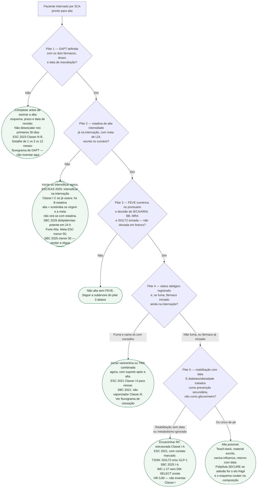
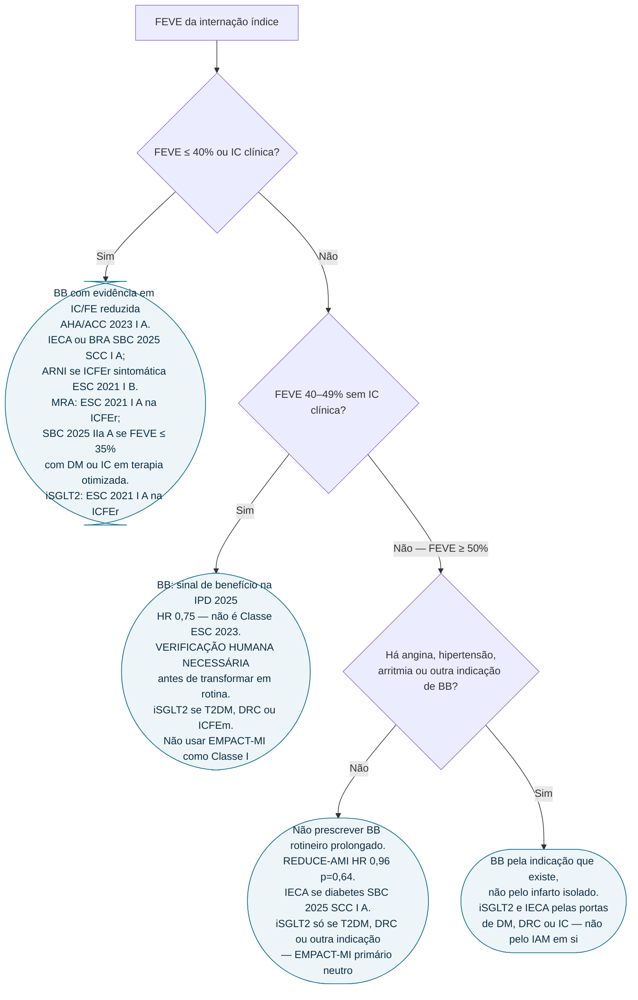

# Fluxograma: alta após SCA — os cinco pilares modificáveis

A pergunta desta árvore não é “o paciente pode ir embora?”. É: **os cinco pilares modificáveis estão prescritos, datados e explicados, ou a alta está incompleta?** O playbook em prosa está em `prevencao-secundaria-integrada-apos-sindrome-coronariana-aguda`. Aqui entra só a sequência da manhã.

Vacina anual contra influenza (ESC 2023, Classe I, nível A) e teach-back na alta (ESC 2023, Classe IIa, nível B) valem para todos os ramos e ficaram de fora do diagrama de propósito: não ramificam.

## Árvore de decisão

## Subárvore do pilar 3 — FEVE e o que não sai por reflexo

## O que as árvores não mostram

**Anticoagulação oral concomitante sai das duas árvores.** Terapia tripla por dias e dupla (P2Y12 + anticoagulante) depois é algoritmo próprio. Encaixar esse paciente no pilar 1 como se fosse só “DAPT mais curta” é o erro clássico da alta.

**O pilar 1 não decide 1 mês versus 12 meses.** MASTER-DAPT, ULTIMATE-DAPT, NEO-MINDSET e TARGET-FIRST não cabem num losango só. O ramo C1 manda para `fluxograma-duracao-e-desescalonamento-da-dapt-apos-icp`. Converter cada ensaio em prazo único é **VERIFICAÇÃO HUMANA NECESSÁRIA**.

**A meta de LDL tem duas réguas.** ESC/EAS mantém < 55 mg/dL e redução ≥ 50% no muito alto risco. A SBC 2025 de dislipidemias usa < 50 mg/dL (Forte, Alta) e < 40 mg/dL no extremo (Forte, Moderada). C2 obriga a anotar qual régua, não a misturá-las.

**EMPACT-MI não aparece como sim/não de iSGLT2.** Aparece como freio: IAM recente de alto risco para IC, sem IC estabelecida, sem diabetes e sem DRC, **não** ganha classe de iSGLT2 com o primário daquele ensaio (HR 0,90; IC95% 0,76–1,06). Quem já tem ICFEr, T2DM ou DRC entra pelas portas que preexistem.

**SELECT não vira Classe I neste diagrama.** O ensaio (PMID 37952131) randomizou DCV + IMC ≥ 27 sem diabetes e reduziu MACE (HR 0,80; IC95% 0,72–0,90). C5 obriga a não ignorar o IMC. A classe de diretriz para semaglutida 2,4 mg nesse nicho permanece **VERIFICAÇÃO HUMANA NECESSÁRIA**.

**Polipílula do SECURE não substitui pilar 3.** AAS + ramipril + atorvastatina não carregam BB, MRA nem iSGLT2. C6 só a oferece quando adesão é o problema e a composição cabe.

**Instabilidade não resolvida bloqueia reabilitação**, não a alta farmacológica. SBC 2021 SCASSST Classe III, nível A contra reabilitar enquanto a condição de instabilidade não estiver resolvida.

## Cruzamentos que a sequência esconde

O iSGLT2 do pilar 3 (IC) e o do pilar 5 (diabetes) são o mesmo comprimido. Quem tem os dois motivos não leva dois iSGLT2. Quem tem só IMC alto sem DM não leva iSGLT2 “porque SELECT” — SELECT é semaglutida 2,4 mg, outra classe.

IECA do pilar 3 e ramipril da polipílula são o mesmo eixo. Escolher polipílula não é acrescentar um terceiro bloqueio do sistema renina-angiotensina.

Reabilitação (pilar 5) é também o lugar em que se confere se os pilares 1–4 sobreviveram às duas primeiras semanas em casa. A ESC 2026 trata otimização farmacológica como componente do programa, não como assunto de outro setor.

## Documentos para os quais cada ramo despacha

- Pilar 1: `fluxograma-duracao-e-desescalonamento-da-dapt-apos-icp`, `sindrome-coronariana-aguda-duracao-de-dapt-complemento-final`, `posologia-de-antiagregantes-e-anticoagulantes-na-sindrome-coronariana-aguda-esc-2023`, `master-dapt-dapt-abreviada-em-alto-risco-hemorragico`, `ultimate-dapt-ticagrelor-monoterapia-apos-1-mes-acs-pci`
- Pilar 2: `dislipidemia-metas-ldl-estratificacao-risco-esc-eas-2025`, `fluxograma-dislipidemia-meta-de-ldl-e-escalonamento-esc-eas-2025`
- Pilar 3: `reduce-ami-betabloqueador-pos-iam-fe-preservada`, `betabloqueador-pos-iam-evidencia-estratificada-por-feve-40-49-versus-50`, `empact-mi-empagliflozina-pos-iam-alto-risco`
- Pilar 4: `fluxograma-cessacao-do-tabagismo-no-cardiopata-farmacoterapia-e-seguimento`
- Pilar 5: `reabilitacao-cardiaca-e-prescricao-de-exercicio-na-prevencao-secundaria`, `esc-2026-reabilitacao-cardiaca-sintese-pratica-corvia`, `select-semaglutida-desfechos-cardiovasculares-obesidade-sem-diabetes`, `inibidores-de-sglt2-e-protecao-cardiovascular-empa-reg-outcome-e-declare-timi-58`, `polipilula-em-prevencao-secundaria-pos-infarto-o-ensaio-secure`
