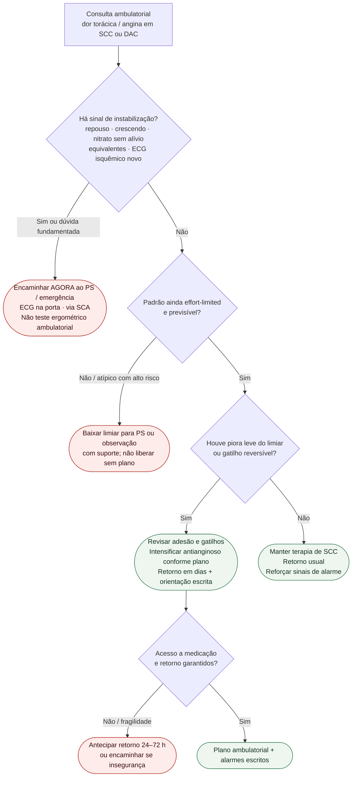

# Fluxograma ambulatorial: dor torácica crônica — quando escalar

Prosa: [`sinalizadores-ambulatoriais-de-angina-instabilizando-quando-encaminhar`](sinalizadores-ambulatoriais-de-angina-instabilizando-quando-encaminhar.md). Pós-IAM: [`pos-iam-ambulatorial-sinais-de-alarme-nas-primeiras-semanas`](pos-iam-ambulatorial-sinais-de-alarme-nas-primeiras-semanas.md). Vias agudas: [`fluxograma-sindrome-coronariana-aguda-esc-2023`](fluxograma-sindrome-coronariana-aguda-esc-2023.md).

## Árvore de decisão

## Notas

- **D1** = gate de segurança (ESC 2023 ACS / ESC 2024 CCS): decide PS vs. consultório.
- **D2–D3** = braço estável: não reabre 0/1 h de troponina nem timing invasivo de NSTE.
- **D4** = segurança do plano (acesso/fragilidade), não nova classe terapêutica.
- Não decide doses, escolha de P2Y12 nem estratégia de reperfusão.
