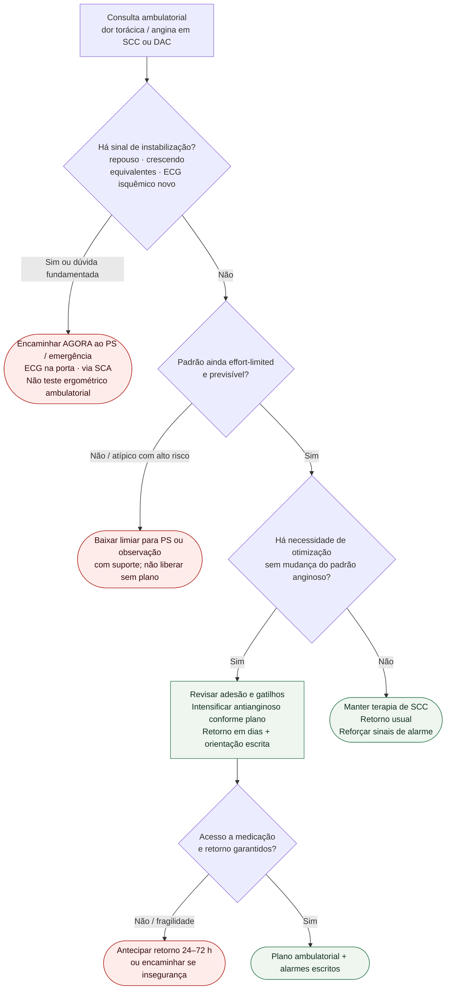

# Fluxograma ambulatorial: dor torácica crônica — quando escalar

Prosa: [[sinalizadores-ambulatoriais-de-angina-instabilizando-quando-encaminhar](/biblioteca/sinalizadores-ambulatoriais-de-angina-instabilizando-quando-encaminhar)](/biblioteca/sinalizadores-ambulatoriais-de-angina-instabilizando-quando-encaminhar). Pós-IAM: [[pos-iam-ambulatorial-sinais-de-alarme-nas-primeiras-semanas](/biblioteca/pos-iam-ambulatorial-sinais-de-alarme-nas-primeiras-semanas)](/biblioteca/pos-iam-ambulatorial-sinais-de-alarme-nas-primeiras-semanas). Vias agudas: [[fluxograma-sindrome-coronariana-aguda-esc-2023](/biblioteca/fluxograma-sindrome-coronariana-aguda-esc-2023)](/biblioteca/fluxograma-sindrome-coronariana-aguda-esc-2023).

## Árvore de decisão

## Notas

- **D1** = gate de segurança (ESC 2023 ACS / ESC 2024 CCS): decide PS vs. consultório.
- **D2–D3** = braço estável: não reabre 0/1 h de troponina nem timing invasivo de NSTE.
- **D4** = segurança do plano (acesso/fragilidade), não nova classe terapêutica.
- Não decide doses, escolha de P2Y12 nem estratégia de reperfusão.

## Segurança diagnóstica

Alívio ou ausência de alívio com nitrato não confirma nem exclui SCA. ECG normal também não a exclui. Suspeita razoável exige via aguda com ECG/troponina seriados e observação; não teste ergométrico nem espera domiciliar por troponina. No pós-IAM considerar reinfarto/trombose de stent, pericardite, complicação mecânica, IC, arritmia e causas não cardíacas. Sangramento menor pede avaliação e não suspensão empírica de DAPT; cefaleia súbita grave sob antitrombótico é alarme neurológico, não diagnóstico de hemorragia sem imagem.
