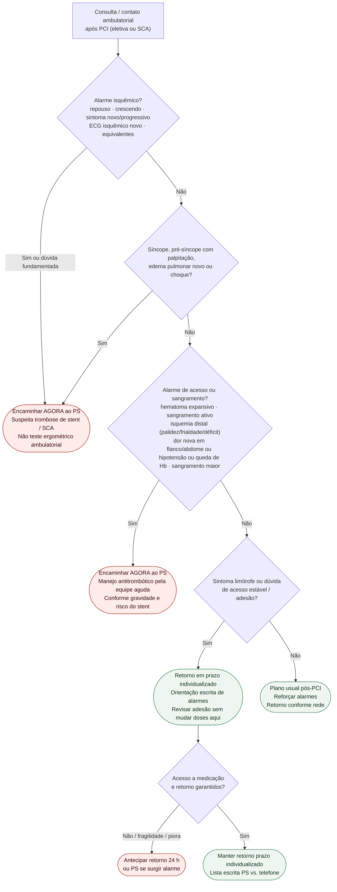

# Fluxograma ambulatorial pós-PCI: destino

Prosa: [`sinalizadores-ambulatoriais-pos-pci-quando-encaminhar`](/biblioteca/sinalizadores-ambulatoriais-pos-pci-quando-encaminhar). Acesso/sangramento: [`acesso-e-sangramento-pos-pci-ambulatorial-alarme-sem-doses`](/biblioteca/acesso-e-sangramento-pos-pci-ambulatorial-alarme-sem-doses). Angina/pós-IAM (#843): [`sinalizadores-ambulatoriais-de-angina-instabilizando-quando-encaminhar`](/biblioteca/sindrome-coronariana-aguda-diagnostico-e-manejo-esc-2023).

## Árvore de decisão

## Notas

- **D1** = gate de segurança isquêmico (ESC 2023 ACS / ESC 2024 CCS): trombose de stent até prova em contrário.
- **D2** = gate vascular/hemorrágico pós-procedimento (ESC/EACTS 2018 + prática de acesso).
- **D3–D4** = braço estável com retorno precoce — não decide duração de DAPT nem escolha de P2Y12.
- Não reabre 0/1 h de troponina, timing NSTE nem estratégia de reperfusão.

## Classificação e acesso

Pseudoaneurisma/FAV suspeitos estáveis requerem Doppler e avaliação rápida; frêmito isolado não obriga PS. Isquemia, sangramento/expansão, compressão, infecção, IC de alto débito sintomática ou instabilidade mudam para emergência. Sangramento visível não é automaticamente maior: usar [maior, CRNM e nuisance](/biblioteca/sinalizadores-ambulatoriais-doac-sangramento-quando-encaminhar). Hematêmese/melena e sinais neurológicos requerem avaliação urgente; hematúria/epistaxe dependem de intensidade, anemia e repercussão. Não mudar DAPT por nuisance sem equipe PCI; sangramento maior segue emergência. Retornos de prazo individualizado são operacionais, nunca prazo para resolver falta do antiplaquetário.
