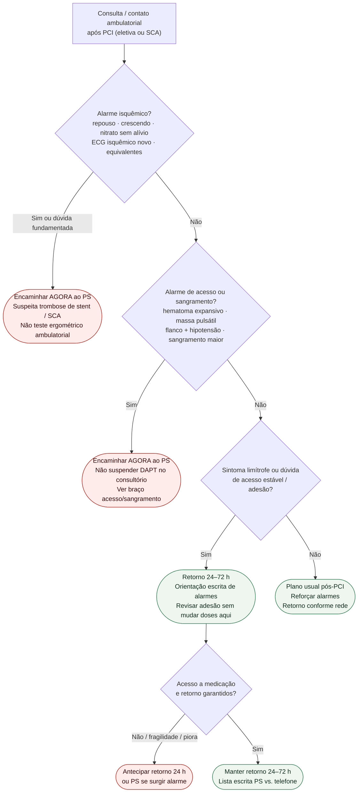

# Fluxograma ambulatorial pós-PCI: destino

Prosa: [`sinalizadores-ambulatoriais-pos-pci-quando-encaminhar`](sinalizadores-ambulatoriais-pos-pci-quando-encaminhar.md). Acesso/sangramento: [`acesso-e-sangramento-pos-pci-ambulatorial-alarme-sem-doses`](acesso-e-sangramento-pos-pci-ambulatorial-alarme-sem-doses.md). Angina/pós-IAM (#843): [`sinalizadores-ambulatoriais-de-angina-instabilizando-quando-encaminhar`](sinalizadores-ambulatoriais-de-angina-instabilizando-quando-encaminhar.md).

## Árvore de decisão

## Notas

- **D1** = gate de segurança isquêmico (ESC 2023 ACS / ESC 2024 CCS): trombose de stent até prova em contrário.
- **D2** = gate vascular/hemorrágico pós-procedimento (ESC/EACTS 2018 + prática de acesso).
- **D3–D4** = braço estável com retorno precoce — não decide duração de DAPT nem escolha de P2Y12.
- Não reabre 0/1 h de troponina, timing NSTE nem estratégia de reperfusão.
