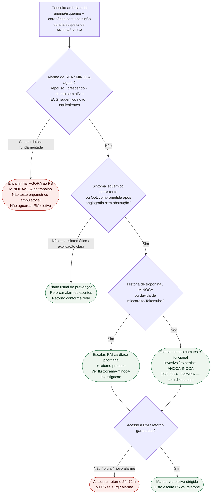

# Fluxograma ambulatorial: suspeita de INOCA/MINOCA — destino

Prosa: [`suspeita-ambulatorial-inoca-minoca-quando-escalar`](suspeita-ambulatorial-inoca-minoca-quando-escalar.md). Pós-angiografia: [`pos-angiografia-sem-obstrucao-ambulatorial-alarme-e-encaminhamento`](pos-angiografia-sem-obstrucao-ambulatorial-alarme-e-encaminhamento.md). Diagnóstico: [`anoca-inoca-angina-e-isquemia-sem-obstrucao-coronariana-esc-2024`](anoca-inoca-angina-e-isquemia-sem-obstrucao-coronariana-esc-2024.md). MINOCA hospitalar: [`fluxograma-minoca-investigacao-diagnostica`](fluxograma-minoca-investigacao-diagnostica.md).

## Árvore de decisão

## Notas

- **D1** = gate de segurança (ESC 2023 ACS / ESC 2024 CCS): anatomia prévia sem obstrução **não** cancela SCA/MINOCA agudo.
- **D2–D3** = braço estável: AHA MINOCA (trabalho diagnóstico) + ESC 2024 (CFT quando mecanismo incerto / sintomas persistentes).
- **D4** = operacional local — não decide endótipo nem farmacoterapia.
- Não reabre limiares de CFR/IMR, ACh provocativo nem vias 0/1 h de troponina.
