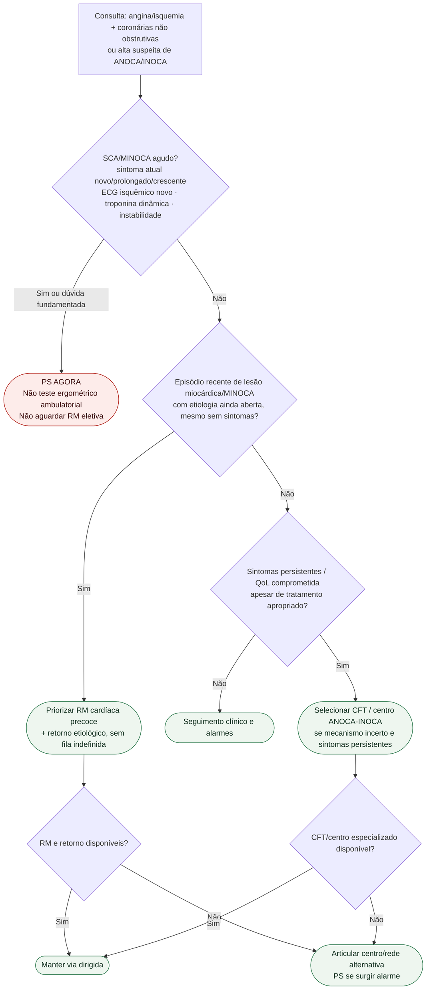

# Fluxograma ambulatorial: suspeita de INOCA/MINOCA — destino

Prosa: [suspeita-ambulatorial-inoca-minoca-quando-escalar](/biblioteca/suspeita-ambulatorial-inoca-minoca-quando-escalar). Pós-angiografia: [pos-angiografia-sem-obstrucao-ambulatorial-alarme-e-encaminhamento](/biblioteca/pos-angiografia-sem-obstrucao-ambulatorial-alarme-e-encaminhamento). Diagnóstico: [anoca-inoca-angina-e-isquemia-sem-obstrucao-coronariana-esc-2024](/biblioteca/anoca-inoca-angina-e-isquemia-sem-obstrucao-coronariana-esc-2024). MINOCA: [fluxograma-minoca-investigacao-diagnostica](/biblioteca/fluxograma-minoca-investigacao-diagnostica).

## Notas

- Dor crônica/cíclica em repouso sem piora e sem alarme atual não é automaticamente SCA; pode seguir via especializada de vasoespasmo.
- Acesso deve ser checado para o **exame escolhido**: RM e CFT são ramos distintos.

- Não redefine endótipos nem farmacoterapia.

MINOCA segue a nomenclatura de lesão miocárdica com coronárias não obstrutivas da Quinta Definição Universal 2026; ver [distinção de IAM e ANOCA/INOCA](/biblioteca/suspeita-ambulatorial-inoca-minoca-quando-escalar).

CFT não é automático após angiografia normal: selecionar conforme sintomas persistentes apesar de cuidado apropriado, hipótese, testes prévios e expertise. CorMicA apoia benefício sintomático/qualidade de vida, sem comprovar redução de mortalidade/MACE. Resposta a nitrato não confirma nem exclui SCA.
