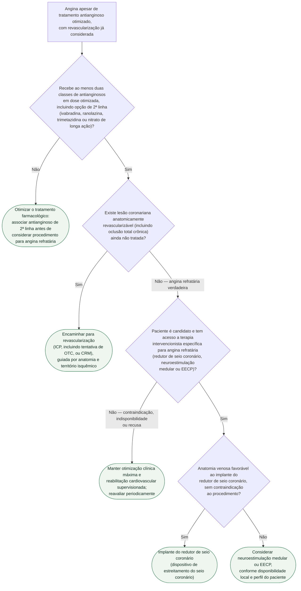

# Fluxograma: Angina estável refratária — manejo escalonado

Angina refratária é definida pela persistência de sintomas isquêmicos apesar de
tratamento antianginoso otimizado **e** de revascularização já realizada ou
formalmente considerada inviável. É uma minoria dos pacientes com doença
coronariana crônica, mas o cardiologista clínico esbarra nela com frequência
maior do que o volume de evidência sugere — as opções de 3ª linha (redutor de
seio coronário, neuroestimulação medular, contrapulsação externa
intensificada/EECP) têm nível de evidência mais baixo que o restante do
arsenal antianginoso, e a diretriz ESC 2024 não estabelece uma hierarquia
rígida entre elas. O fluxograma abaixo organiza a sequência de decisões antes
de chegar a esse ponto, e como escolher entre as opções quando se chega.

## Árvore de decisão

## O que a árvore não mostra

**A ORBITA-2 mudou a leitura de "já tentei tudo" antes da 3ª linha.** O
ensaio, duplo-cego e controlado por placebo (sham), mostrou que a ICP reduz
angina mesmo em pacientes já otimizados clinicamente — o que reforça que a
revascularização anatomicamente possível (mesmo de oclusão total crônica)
deve ser exaurida antes de rotular alguém como refratário verdadeiro. A
árvore reflete isso ao colocar D2 (lesão revascularizável) antes de qualquer
terapia de 3ª linha.

**Não há hierarquia formal entre redutor de seio coronário, neuroestimulação
medular e EECP.** A diretriz ESC 2024 lista as três como opções de
classe IIb, sem comparação direta entre elas. A árvore usa a anatomia venosa
favorável como critério de desempate porque é a única checagem objetiva e
rápida disponível à beira do leito — na prática, disponibilidade local e
experiência do centro pesam tanto quanto a anatomia.

**O nível de evidência da 3ª linha é modesto e precisa ser comunicado ao
paciente.** O ensaio do redutor de seio coronário (COSIRA) randomizou 104
pacientes e teve como desfecho primário a melhora de pelo menos duas classes
da Canadian Cardiovascular Society (CCS) ou pelo menos uma classe para
CCS I — um desfecho sintomático subjetivo, sem poder para mortalidade ou
eventos cardiovasculares maiores.

**Vasoespasmo e disfunção microvascular (ANOCA/INOCA) não entram nesta
árvore.** Angina refratária pressupõe doença coronariana obstrutiva já
conhecida; quando a angiografia é normal ou quase normal, a investigação
segue outra via, tratada em documento próprio da biblioteca.
