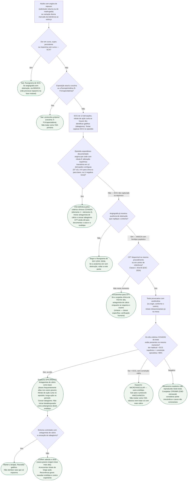

# Fluxograma: angina vasoespástica — teste provocativo e tratamento

Esta árvore começa **depois** de a via de síndrome coronariana crônica ter afastado (ou a angiografia já ter mostrado) obstrução que explique o sintoma — ou quando o fenótipo é tão típico (angina de repouso noturna, ST transitório, resposta a nitrato) que a hipótese de espasmo epicárdico precisa ser nomeada de propósito.

Não é o fluxograma de ANOCA/INOCA inteiro. Só o ramo **espasmo epicárdico**. Cocaína, fluoropirimidina, MINOCA e disfunção microvascular estrutural saem em desvios explícitos.

## Árvore de decisão

## Como ler cada desvio

**C1 — SCA primeiro.** Supra persistente não é “Prinzmetal até prova em contrário”. É oclusão até a angiografia dizer o contrário. O espasmo entra depois, como causa possível de MINOCA, no fluxograma próprio.

**C2 — tóxico-induzido não é VSA primária.** Cocaína e fluoropirimidina têm mecanismo, tempo de reexposição e conduta diferentes. Misturar os três no mesmo ramo ensina o erro.

**C3 — dá para diagnosticar sem cateterismo.** COVADIS aceita VSA definitiva com angina nitrato-responsiva **mais** ECG isquêmico espontâneo, sem exigir o critério 3. A CFT continua útil, mas não é o que autoriza começar o antagonista de cálcio.

**C5 — o empirismo tem preço.** Começar cálcio na suspeita alta enquanto a CFT não está disponível é síntese clínica, não linha Classe I lida na ESC 2024. Se o endótipo real for microvascular estrutural, o cálcio isolado pode não ser a melhor primeira escolha. Por isso o encaminhamento para CFT permanece o alvo (Classe I B).

**C6 versus C7 — o corte de 90%.** Os três critérios juntos definem epicárdico. Dor + ECG sem constrição > 90% é microvascular. Relatar o percentual; não copiar o ≥ 75% do ACOVA (2012), que é pré-COVADIS.

**C8 — teste negativo não é alta com “ansiedade”.** A metade adenosina da CFT (CFR/IMR) ainda não foi lida nesse ramo. Ponte miocárdica também causa angina com artéria “livre” na diástole.

## O que a árvore não mostra

**Protocolo miligrama a miligrama de acetilcolina.** Varia entre centros (Japão versus Europa, dose máxima na DA versus circunflexa/direita). Não cabe em bifurcação binária e não foi lido como tabela ESC 2024. **VERIFICAÇÃO HUMANA NECESSÁRIA** para protocolar dose institucional.

**Janela de 48 horas sem nitrato/cálcio antes do teste.** Prática de laboratório para reduzir falso-negativo; não conferida como recomendação classificada da ESC 2024.

**Contraindicações absolutas do teste.** Listas japonesas e de revisões especializadas existem (tronco não tratado, disfunção ventricular grave, gestação, SCA instável). Não reproduzir como se fossem da ESC 2024 sem conferir o PDF. **VERIFICAÇÃO HUMANA NECESSÁRIA.**

**Classe e nível do antagonista de cálcio, do nitrato e da “proibição” de betabloqueador.** O texto da ESC 2024 aponta o cálcio como primeira linha do endótipo vasoespástico; COVADIS usa a resposta diferencial cálcio versus betabloqueador como critério diagnóstico. Nenhuma das duas frases foi lida aqui como Classe I ou Classe III numerada. A árvore trata o cálcio como base **sem** inventar classe.

**CDI após parada atribuída a espasmo, nicorandil, dose-alvo de diltiazem/verapamil.** Fora do recorte. Não fechar.

**Sexo.** Coortes posteriores ao ACOVA sugerem mais espasmo epicárdico em homens e mais microvascular em mulheres — epidemiologia, não bifurcação da árvore. A leitura do teste é a mesma.

## Tudo com Tudo

- [Protocolo: angina vasoespástica — critérios COVADIS, diagnóstico e tratamento](angina-vasoespastica-criterios-covadis-diagnostico-e-tratamento.md)
- [ANOCA/INOCA — protocolo geral ESC 2024](anoca-inoca-angina-e-isquemia-sem-obstrucao-coronariana-esc-2024.md)
- [Fluxograma de síndrome coronariana crônica — ESC 2024](fluxograma-sindrome-coronariana-cronica-esc-2024.md)
- [Fluxograma MINOCA](fluxograma-minoca-investigacao-diagnostica.md)
- [MINOCA e SCAD](minoca-e-scad-infarto-sem-doenca-coronariana-obstrutiva-e-dissecção-espontânea.md)
- [Disfunção microvascular e CorMicA](../Farmacologia/disfuncao-microvascular-coronariana-angina-microvascular-diagnostico-funcional-e-tratamento-guiado.md)
- [Cocaína](../Geral/cocaina-e-risco-cardiovascular-vasoespasmo-coronariano-e-infarto.md)
- [Fluoropirimidinas](../Cardio-oncologia/sindrome-coronariana-aguda-e-vasoespasmo-por-fluoropirimidinas-5fu-capecitabina.md)
