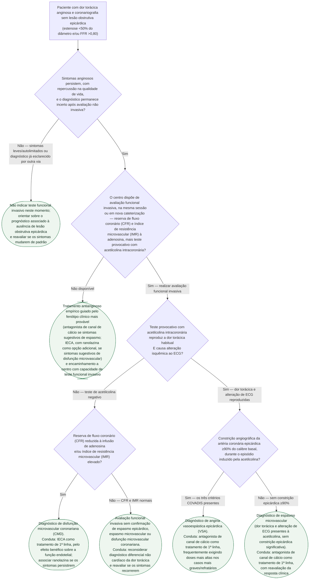

# Fluxograma: ANOCA/INOCA — investigação funcional invasiva e conduta por endótipo

## Por que este fluxograma existe

O documento em prosa já publicado neste tema ("ANOCA/INOCA: Angina e Isquemia
sem Obstrução Coronariana Significativa — ESC 2024") explica a mudança de
prática trazida pela diretriz e descreve os dois endótipos. Este fluxograma é
o complemento operacional: transforma essa descrição no caminho de decisão que
se percorre à beira da mesa de hemodinâmica — quando indicar a avaliação
funcional invasiva, o que fazer com o resultado do teste de acetilcolina e da
reserva de fluxo coronário, e qual o tratamento de 1ª linha em cada desfecho.
O documento sobre angina refratária já publicado neste tema aponta
explicitamente que esse recorte "não entra nesta árvore... é tratada em
documento próprio da biblioteca" — este é esse documento.

## Definições rápidas

- **ANOCA/INOCA**: angina ou isquemia com artérias coronárias epicárdicas sem
  lesão obstrutiva (estenose <50% do diâmetro e/ou FFR >0,80) à angiografia
  invasiva.
- **CFR (reserva de fluxo coronário)** e **IMR (índice de resistência
  microvascular)**: medidos com fio de pressão/temperatura durante infusão de
  adenosina, avaliam a capacidade da microvasculatura coronariana de dilatar
  em resposta ao aumento de demanda de oxigênio.
- **Teste provocativo com acetilcolina intracoronária**: induz vasoespasmo em
  dose escalonada, sob monitorização de ECG e sintomas.
- **Critérios COVADIS**: (1) reprodução da dor torácica habitual, (2)
  alteração isquêmica ao ECG, (3) constrição angiográfica ≥90% do calibre da
  artéria coronária epicárdica. Os três presentes definem **espasmo
  epicárdico**; apenas os dois primeiros, sem a constrição de 90%, definem
  **espasmo microvascular**.

## Árvore de decisão

## O que a árvore não mostra

**A recomendação de disponibilizar avaliação funcional invasiva já na
angiografia diagnóstica é Classe I, Nível B na ESC 2024.** O texto da
diretriz, citado em Sucato et al. 2024: *"em pacientes com diagnóstico
incerto após teste não invasivo, angiografia coronariana invasiva com
disponibilidade de avaliação funcional invasiva é recomendada para confirmar
ou excluir o diagnóstico de DAC obstrutiva ou ANOCA/INOCA"*. A árvore separa
essa disponibilidade em D2 porque, na prática brasileira, nem todo centro que
faz cateterismo diagnóstico tem o fio de pressão/temperatura e o protocolo de
acetilcolina prontos no mesmo procedimento — e essa é, sozinha, a diferença
entre diagnosticar o endótipo e tratar empiricamente.

**CFR/IMR e o teste de acetilcolina são, na prática, realizados dentro da
mesma sessão invasiva, não necessariamente nesta ordem.** A árvore apresenta
o teste de acetilcolina antes da checagem de CFR/IMR (D3 antes de D4) por
clareza de raciocínio diagnóstico — é o que primeiro separa o eixo
"vasoespasmo" do eixo "disfunção microvascular sem espasmo" —, não porque a
diretriz determine essa sequência. Nenhuma fonte consultada nesta sessão
especifica a ordem cronológica de execução dos dois testes dentro do
procedimento.

**A árvore não cria uma categoria de endótipo misto (espasmo + disfunção
microvascular coexistentes) como conduta separada.** Isso é intencional: as
fontes consultadas descrevem os dois endótipos e seus tratamentos de 1ª linha
de forma independente, sem propor um algoritmo formal de tratamento combinado
para quem tem os dois. Quando o teste de acetilcolina confirma espasmo (C5 ou
C6) e o CFR/IMR também está alterado, a conduta desta árvore prioriza o
antagonista de canal de cálcio pela via do espasmo — associar IECA/ranolazina
nesse cenário é decisão clínica individualizada, não coberta por recomendação
formal encontrada nesta sessão.

**O corte numérico de CFR e IMR que definem disfunção microvascular não está
nesta árvore.** O documento-irmão deste tema já registra essa mesma
pendência (`VERIFICAÇÃO HUMANA NECESSÁRIA`): os valores exatos de corte não
foram confirmados diretamente contra uma fonte primária nesta sessão, e por
isso os nós D4/C3 usam "reduzida"/"elevado" em vez de um número não
verificado.

**Ponte miocárdica e aterosclerose difusa sem lesão focal**, citadas como
outras causas possíveis de ANOCA/INOCA no documento-irmão, não entram nesta
árvore — o recorte aqui é estritamente a investigação funcional dos dois
endótipos com teste e tratamento mais bem definidos nas fontes consultadas
(espasmo e disfunção microvascular).
