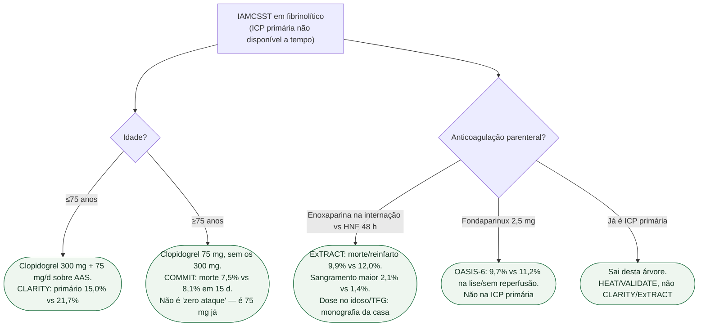

# Fluxograma: adjunto à lise no IAMCSST

```mermaid
flowchart TD
  R0["IAMCSST em fibrinolítico<br/>(ICP primária não disponível a tempo)"] --> D1{"Idade?"}

  D1 -->|"≤75 anos"| C1(["Clopidogrel 300 mg + 75 mg/d sobre AAS.<br/>CLARITY: primário 15,0% vs 21,7%"])

  D1 -->|"≥75 anos"| C2(["Clopidogrel 75 mg, sem os 300 mg.<br/>COMMIT: morte 7,5% vs 8,1% em 15 d.<br/>Não é 'zero ataque' — é 75 mg já"])

  R0 --> D2{"Anticoagulação parenteral?"}

  D2 -->|"Enoxaparina na internação vs HNF 48 h"| C3(["ExTRACT: morte/reinfarto 9,9% vs 12,0%.<br/>Sangramento maior 2,1% vs 1,4%.<br/>Dose no idoso/TFG: monografia da casa"])

  D2 -->|"Fondaparinux 2,5 mg"| C4(["OASIS-6: 9,7% vs 11,2% na lise/sem reperfusão.<br/>Não na ICP primária"])

  D2 -->|"Já é ICP primária"| C5(["Sai desta árvore.<br/>HEAT/VALIDATE, não CLARITY/ExTRACT"])

  classDef conduta fill:#eef6ef,stroke:#2f7a4f,color:#12301f;
  class C1,C2,C3,C4,C5 conduta;
```

## Mensagem prática

**Lise: clopidogrel (ataque conforme a idade) + enoxaparina ou fondaparinux conforme o ensaio.** ICP primária é outro fluxograma.
