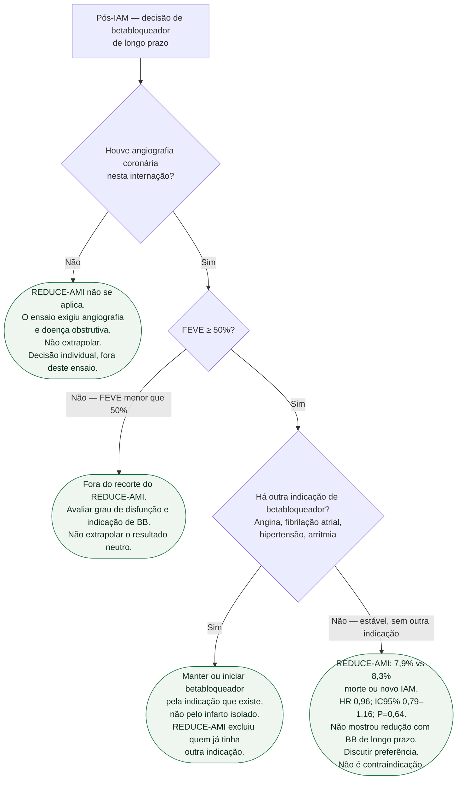

# Fluxograma: betabloqueador de longo prazo após IAM — REDUCE-AMI

Pergunta desta árvore: **neste paciente após IAM, o REDUCE-AMI informa a decisão de betabloqueador de longo prazo?** Não informa a fase aguda intravenosa. Não inventa classe de recomendação na FE reduzida. Folhas verdes são condutas.

Vacina, estatina, antitrombótico e reabilitação valem para todos os ramos e ficaram fora do diagrama de propósito: não ramificam com o REDUCE-AMI.

## Árvore de decisão

## O que a árvore não mostra

**Fase aguda intravenosa.** A raiz é a decisão **oral de longo prazo**, em paciente já internado. Betabloqueador IV na apresentação, na reperfusão ou no infarto hiperagudo é outra pergunta. O REDUCE-AMI randomizou entre os dias 1 e 7, com metoprolol ou bisoprolol orais. Não extrapolar C4 para o IV.

**FE reduzida não ganha classe neste diagrama.** C2 identifica população não estudada, sem tornar todo valor abaixo de 50% uma indicação automática. Quem precisa de classe e nível deve ir ao documento de insuficiência cardíaca, não a este fluxograma.

**C4 não manda suspender quem já usa e tolera por outro motivo.** O ensaio comparou estratégia de usar versus não usar betabloqueador de longo prazo **nessa população**, após IAM recente com FEVE ≥ 50% e angiografia. Não é um ensaio de descontinuação tardia em coronariopata estável de anos. E não é contraindicação: 7,9% versus 8,3% é resultado **neutro**, não sinal de dano.

**Números que cabem na folha C4, e só esses.** 5.020 pacientes; 95,4% da Suécia; seguimento mediano 3,5 anos (IIQ 2,2–4,7); 199/2.508 (7,9%) versus 208/2.512 (8,3%); HR 0,96; IC95% 0,79–1,16; P = 0,64. Morte 3,9% vs 4,1%; morte CV 1,5% vs 1,3%; IAM 4,5% vs 4,7%; internamento por FA 1,1% vs 1,4%; internamento por IC 0,8% vs 0,9%. Nada além disso entra na árvore.

**Preferência compartilhada.** Quando o ramo cai em C4, a conduta é conversar — ver o documento de comunicação clínica desta tríade — não decretar “proibido” nem “obrigatório”.

## Diretriz vigente
A ESC 2026 de IC recomenda betabloqueador no estágio B com FEVE <50% para reduzir internação por IC ou morte (Classe I, nível B1). Essa recomendação de diretriz deve ser distinguida dos resultados de cada ensaio e da IPD restrita a FEVE ≥50%. Disfunção ventricular assintomática após IAM pode configurar estágio B; ausência de sintomas não exclui essa indicação. Avaliar contraindicações e tolerância.

## Aplicação individual
Angina, FA ou hipertensão só justificam manutenção se houver indicação clínica específica para betabloqueador; o diagnóstico isolado não torna a classe obrigatória. IC com FE preservada tampouco é indicação universal. Esses estudos não devem ser usados para retirar tratamento de disfunção sistólica relevante.

A decisão de não iniciar após IAM recente não equivale à retirada tardia. ABYSS não demonstrou não inferioridade da interrupção para seu composto amplo; SMART-DECISION demonstrou não inferioridade em pacientes estáveis, FEVE ≥40%, sem IC, tratados por pelo menos um ano, para morte, novo IAM ou internação por IC. Populações, desfechos e margens diferem. Reavaliar individualmente; não suspender abruptamente.

## Tudo com Tudo

Doença coronariana · Insuficiência cardíaca · Hipertensão · Arritmias · Fibrilação atrial · Comunicação clínica · Reabilitação cardíaca
