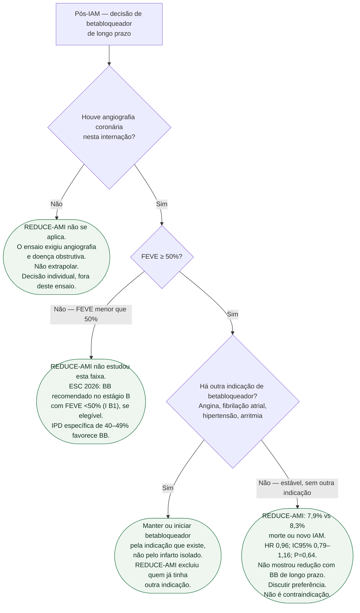

# Fluxograma: betabloqueador de longo prazo após IAM — REDUCE-AMI

Pergunta desta árvore: **neste paciente após IAM, o REDUCE-AMI informa a decisão de betabloqueador de longo prazo?** Não informa a fase aguda intravenosa. Não inventa classe de recomendação na FE reduzida. Folhas verdes são condutas.

Vacina, estatina, antitrombótico e reabilitação valem para todos os ramos e ficaram fora do diagrama de propósito: não ramificam com o REDUCE-AMI.

## Árvore de decisão

## O que a árvore não mostra

**Fase aguda intravenosa.** A raiz é a decisão **oral de longo prazo**, em paciente já internado. Betabloqueador IV na apresentação, na reperfusão ou no infarto hiperagudo é outra pergunta. O REDUCE-AMI randomizou entre os dias 1 e 7, com metoprolol ou bisoprolol orais. Não extrapolar C4 para o IV.

**FEVE <50%.** O ramo C2 se apoia na evidência específica e na recomendação ESC 2026, detalhadas abaixo; não extrapola o REDUCE-AMI.

**C4 não manda suspender quem já usa e tolera por outro motivo.** O ensaio comparou estratégia de usar versus não usar betabloqueador de longo prazo **nessa população**, após IAM recente com FEVE ≥ 50% e angiografia. Não é um ensaio de descontinuação tardia em coronariopata estável de anos. E não é contraindicação: 7,9% versus 8,3% é resultado **neutro**, não sinal de dano.

**Números que cabem na folha C4, e só esses.** 5.020 pacientes; 95,4% da Suécia; seguimento mediano 3,5 anos (IIQ 2,2–4,7); 199/2.508 (7,9%) versus 208/2.512 (8,3%); HR 0,96; IC95% 0,79–1,16; P = 0,64. Morte 3,9% vs 4,1%; morte CV 1,5% vs 1,3%; IAM 4,5% vs 4,7%; internamento por FA 1,1% vs 1,4%; internamento por IC 0,8% vs 0,9%. Nada além disso entra na árvore.

**Preferência compartilhada.** Quando o ramo cai em C4, a conduta é conversar — ver o documento de comunicação clínica desta tríade — não decretar “proibido” nem “obrigatório”.

## Evidência específica na FEVE 40–49% e ESC 2026

A meta-análise individual de quatro ensaios (PMID **40897190**) reuniu **1.885 pacientes após IAM, FEVE 40–49%, sem história ou sinais de IC**: REBOOT 979, BETAMI 422, DANBLOCK 430 e CAPITAL-RCT 54. Foram **991** alocados a betabloqueador e **894** ao controle. Morte, novo IAM ou IC ocorreu em **106 versus 129** participantes; **32,6 versus 43,0 por 1.000 pessoas-ano**; **HR 0,75 (IC95% 0,58–0,97), P=0,031**. Este resultado é distinto da IPD de FEVE ≥50% e do REBOOT global; nenhum ensaio isolado tinha poder adequado para esse subgrupo.

A ESC 2026 recomenda betabloqueador no **estágio B com FEVE <50% (I B1)** para prevenir IC. A decisão requer estabilidade, avaliação de contraindicações e tolerabilidade; esta recomendação não deriva do REDUCE-AMI nem do resultado neutro na FEVE ≥50%. Não se deve descrever 40–49% como uma faixa sem evidência ou usar a neutralidade de ≥50% para negar tratamento abaixo desse corte.

## Tudo com Tudo

- [Fluxograma: betabloqueador após IAM — REBOOT e IPD 2025](/biblioteca/fluxograma-betabloqueador-pos-iam-reboot-e-ipd-2025)
- [REDUCE-AMI: betabloqueador de longo prazo após IAM com FEVE preservada](/biblioteca/reduce-ami-betabloqueador-apos-iam-com-feve-preservada)
- [Metanálise IPD: betabloqueador após IAM com FEVE ≥ 50% — cinco ensaios](/biblioteca/metanalise-ipd-betabloqueador-pos-iam-feve-50-cinco-ensaios)
