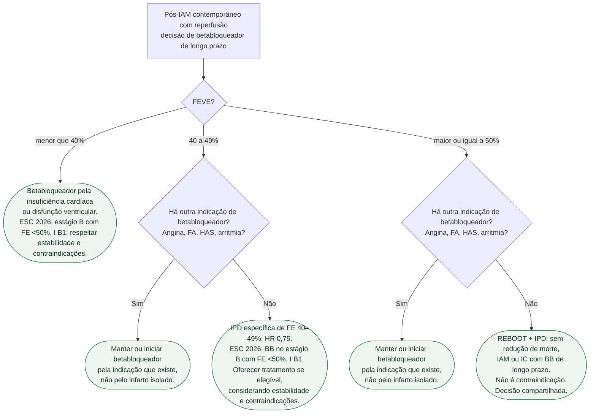

# Fluxograma: betabloqueador após IAM — REBOOT e IPD 2025

Pergunta desta árvore: **neste paciente após IAM contemporâneo com reperfusão, a FEVE informa a decisão de betabloqueador de longo prazo?** Folhas verdes são condutas. A classe de recomendação abaixo vem da ESC 2026; os ensaios são interpretados em seus próprios recortes.

Vacina, estatina, antitrombótico e reabilitação valem para todos os ramos e ficaram fora do diagrama de propósito: não ramificam com REBOOT nem com a IPD.

## Árvore de decisão

## Como ler cada folha

**C1 — FEVE <40%.** Betabloqueador pela disfunção ventricular ou IC, conforme indicação, estabilidade e tolerabilidade. A recomendação ESC para estágio B com FE <50% é I B1.

**C2 e C4 — outra indicação.** Folhas **duplicadas** de propósito (um pai cada). Angina, fibrilação atrial, hipertensão ou arritmia justificam a classe **independentemente** da FEVE 41–49% ou ≥ 50%. REBOOT e a IPD excluíram, no recorte relevante, quem já tinha essa indicação. Não suspender no automático.

**C3 — FEVE 40–49%, sem outra indicação.** O REBOOT global (FE >40%) foi neutro, mas a meta-análise específica dessa faixa reuniu quatro ensaios e mostrou redução do composto de morte/IAM/IC (HR 0,75). A recomendação ESC 2026 para estágio B com FE <50% é I B1. O resultado da IPD de FE ≥50% não deve ser extrapolado para este ramo.

**C5 — FEVE ≥ 50%, sem outra indicação.** Duas peças, mesmos recorte de FE preservada, compostos lidos em separado:

- IPD de cinco ensaios, **17.801** pacientes, FEVE ≥ 50%: morte, IAM ou IC em **717 (8,1%)** vs **748 (8,3%)**; HR **0,97**; IC95% **0,87–1,07**; P = **0,54**. Mediana 3,6 anos (IIQ 2,3–4,6).
- REBOOT no conjunto >40% foi neutro: HR 1,04 (IC95% 0,89–1,22), P=0,63; 316 versus 307 eventos, com 8.438 analisados de 8.505 randomizados. O subconjunto de FE ≥ 50% do REBOOT entra na IPD (7.459 dos 17.801).

REDUCE-AMI (PMID 38587241) é o ensaio irmão da FE ≥ 50% (**5.020** pacientes). Não copiar o composto morte/novo IAM do REDUCE-AMI para a folha da IPD, cujo composto inclui insuficiência cardíaca. Resultado nulo **não** é contraindicação.

## O que a árvore não mostra

**Fase aguda intravenosa.** A raiz é oral de longo prazo após IAM contemporâneo já reperfuso. Betabloqueador IV na apresentação é outra pergunta.

**C3 tem evidência própria.** A recomendação para FE <50% requer avaliar contraindicações e estabilidade; não é retirada da IPD de FE preservada.

**C5 não manda suspender quem já usa e tolera por outro motivo.** Isso é C4, folha irmã, pai diferente.

**Não misturar denominadores.** 8.505 (REBOOT, FE > 40%) não é 17.801 (IPD, FE ≥ 50%) não é 5.020 (REDUCE-AMI, FE ≥ 50%). A IPD usou 7.459 do REBOOT, 4.967 do REDUCE-AMI, 2.441 do BETAMI, 2.277 do DANBLOCK e 657 do CAPITAL-RCT.

**Preferência compartilhada.** Em todos os ramos, discutir indicação, riscos e preferências; em C5 a decisão é individualizada — ver o documento de comunicação clínica desta tríade.

## Evidência específica na FEVE 40–49% e ESC 2026

A meta-análise individual de quatro ensaios (PMID **40897190**) reuniu **1.885 pacientes após IAM, FEVE 40–49%, sem história ou sinais de IC**: REBOOT 979, BETAMI 422, DANBLOCK 430 e CAPITAL-RCT 54. Foram **991** alocados a betabloqueador e **894** ao controle. Morte, novo IAM ou IC ocorreu em **106 versus 129** participantes; **32,6 versus 43,0 por 1.000 pessoas-ano**; **HR 0,75 (IC95% 0,58–0,97), P=0,031**. Este resultado é distinto da IPD de FEVE ≥50% e do REBOOT global; nenhum ensaio isolado tinha poder adequado para esse subgrupo.

A ESC 2026 recomenda betabloqueador no **estágio B com FEVE <50% (I B1)** para prevenir IC. A decisão requer estabilidade, avaliação de contraindicações e tolerabilidade; esta recomendação não deriva do REDUCE-AMI nem do resultado neutro na FEVE ≥50%. Não se deve descrever 40–49% como uma faixa sem evidência ou usar a neutralidade de ≥50% para negar tratamento abaixo desse corte.

## Tudo com Tudo

- [Fluxograma: betabloqueador de longo prazo após IAM — REDUCE-AMI](/biblioteca/fluxograma-betabloqueador-longo-prazo-apos-iam-reduce-ami)
- [Metanálise IPD: betabloqueador após IAM com FEVE ≥ 50% — cinco ensaios](/biblioteca/metanalise-ipd-betabloqueador-pos-iam-feve-50-cinco-ensaios)
- [REBOOT: betabloqueador após IAM com FEVE maior que 40%](/biblioteca/reboot-betabloqueador-apos-iam-com-feve-maior-40)
