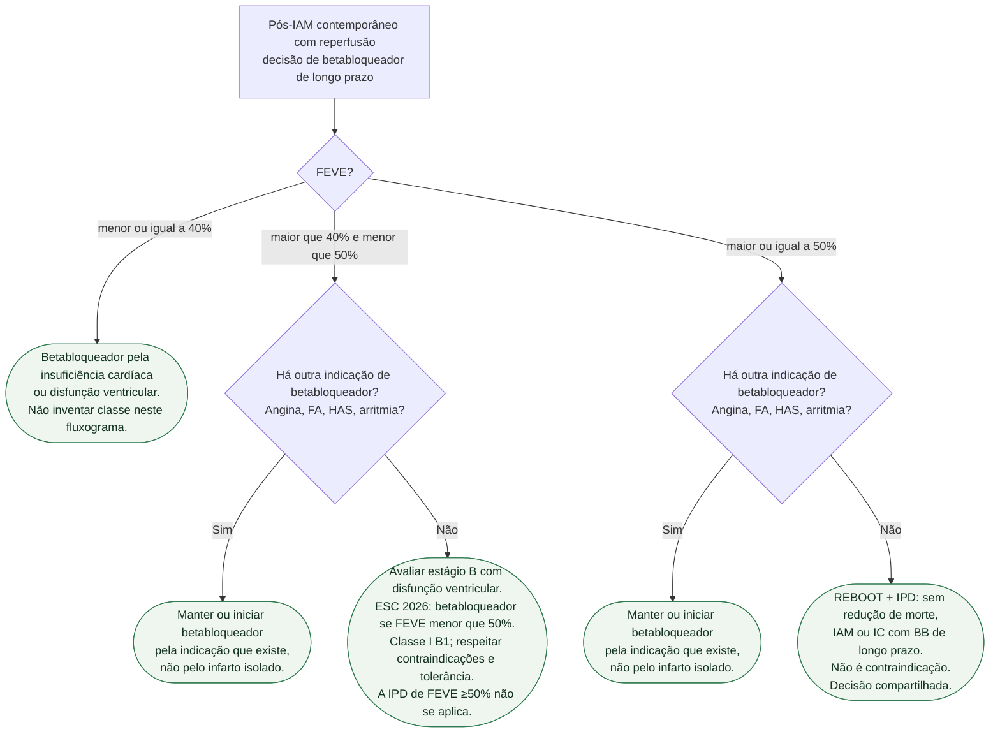

# Fluxograma: betabloqueador após IAM — REBOOT e IPD 2025

Pergunta desta árvore: **neste paciente após IAM contemporâneo com reperfusão, a FEVE informa a decisão de betabloqueador de longo prazo?** Folhas verdes são condutas. Não inventar classe. Não juntar nós: cada folha tem um pai só.

Vacina, estatina, antitrombótico e reabilitação valem para todos os ramos e ficaram fora do diagrama de propósito: não ramificam com REBOOT nem com a IPD.

## Árvore de decisão

## Como ler cada folha

**C1 — FEVE ≤ 40%.** O betabloqueador permanece pela insuficiência cardíaca ou pela disfunção. REBOOT e a IPD **não** estudaram essa faixa. Este fluxograma **não** atribui Classe I, IIa ou qualquer letra: quem precisa de classe vai ao documento de insuficiência cardíaca.

**C2 e C4 — outra indicação.** Folhas **duplicadas** de propósito (um pai cada). Uma indicação específica, como necessidade de controle de frequência ou antianginoso, deve ser confirmada individualmente. REBOOT e a IPD excluíram, no recorte relevante, quem já tinha essa indicação. Não suspender no automático.

**C3 — FEVE >40% e <50%, sem outra indicação.** O REBOOT (PMID 40888702) incluiu FEVE **> 40%** e foi nulo no conjunto: 316 vs 307 eventos de morte, reinfarto ou internação por IC; 22,5 vs 21,7 por 1.000 pessoas-ano; HR 1,04; IC95% 0,89–1,22; P = 0,63; **8.505** pacientes. A IPD (PMID 41211954) exigiu **≥ 50%**. Portanto a evidência da faixa intermediária **não** é a evidência da FE preservada. Conduta: **avaliar estágio B e indicar betabloqueador conforme ESC 2026 (I B1), respeitando contraindicações e tolerância**. Consultar a recomendação da ESC 2026 conforme estágio e FEVE. Não extrapolar o nulo da IPD para baixo.

**C5 — FEVE ≥ 50%, sem outra indicação.** Duas peças com recortes distintos, compostos lidos em separado:

- IPD de cinco ensaios, **17.801** pacientes, FEVE ≥ 50%: morte, IAM ou IC em **717 (8,1%)** vs **748 (8,3%)**; HR **0,97**; IC95% **0,87–1,07**; P = **0,54**. Mediana 3,6 anos (IIQ 2,3–4,6).
- REBOOT no conjunto > 40% foi nulo (números em C3). O subconjunto de FE ≥ 50% do REBOOT entra na IPD (7.459 dos 17.801).

REDUCE-AMI (PMID 38587241) é o ensaio irmão da FE ≥ 50% (**5.020** pacientes). Não copiar o composto morte/novo IAM do REDUCE-AMI para a folha da IPD, cujo composto inclui insuficiência cardíaca. Resultado nulo **não** é contraindicação.

## O que a árvore não mostra

**Fase aguda intravenosa.** A raiz é oral de longo prazo após IAM contemporâneo já reperfuso. Betabloqueador IV na apresentação é outra pergunta.

**C3 deve integrar a diretriz vigente.** A ausência de sintomas de IC após IAM não exclui estágio B com disfunção ventricular; o recorte da IPD ≥50% não cancela a recomendação I B1.

**C5 não manda suspender quem já usa e tolera por outro motivo.** Isso é C4, folha irmã, pai diferente.

**Não misturar denominadores.** 8.505 (REBOOT, FE > 40%) não é 17.801 (IPD, FE ≥ 50%) não é 5.020 (REDUCE-AMI, FE ≥ 50%). A IPD usou 7.459 do REBOOT, 4.967 do REDUCE-AMI, 2.441 do BETAMI, 2.277 do DANBLOCK e 657 do CAPITAL-RCT.

**Preferência compartilhada.** Em C3 e C5 a conduta é conversar — ver o documento de comunicação clínica desta tríade.

## Denominador do REBOOT
Foram 8.505 randomizados e 8.438 incluídos na análise principal. Os 316 versus 307 eventos e as taxas por pessoas-ano pertencem à análise principal.

## Diretriz vigente
A ESC 2026 de IC recomenda betabloqueador no estágio B com FEVE <50% para reduzir internação por IC ou morte (Classe I, nível B1). Essa recomendação de diretriz deve ser distinguida dos resultados de cada ensaio e da IPD restrita a FEVE ≥50%. Disfunção ventricular assintomática após IAM pode configurar estágio B; ausência de sintomas não exclui essa indicação. Avaliar contraindicações e tolerância.

## Aplicação individual
Angina, FA ou hipertensão só justificam manutenção se houver indicação clínica específica para betabloqueador; o diagnóstico isolado não torna a classe obrigatória. IC com FE preservada tampouco é indicação universal. Esses estudos não devem ser usados para retirar tratamento de disfunção sistólica relevante.

A decisão de não iniciar após IAM recente não equivale à retirada tardia. ABYSS não demonstrou não inferioridade da interrupção para seu composto amplo; SMART-DECISION demonstrou não inferioridade em pacientes estáveis, FEVE ≥40%, sem IC, tratados por pelo menos um ano, para morte, novo IAM ou internação por IC. Populações, desfechos e margens diferem. Reavaliar individualmente; não suspender abruptamente.

## Tudo com Tudo

Doença coronariana · Insuficiência cardíaca · Hipertensão · Fibrilação atrial · Comunicação clínica · Reabilitação cardíaca · Farmacologia

## Limite editorial

PMID 40888702, 41211954 e 38587241. Árvore em TD, um pai por nó, folhas duplicadas (C2 e C4). Sem classe inventada. Sem ciclo. Números só os verificados dos abstracts. Não extrapolar IPD para FEVE >40% e <50%.
