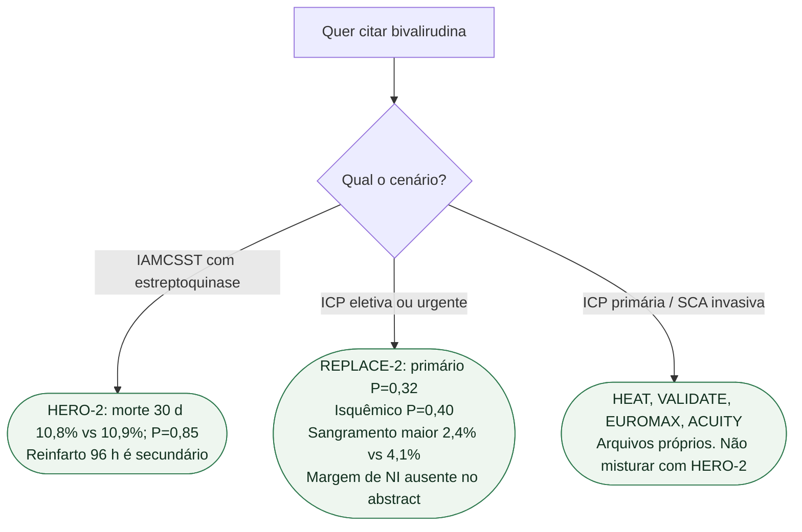

# Fluxograma: onde a bivalirudina foi testada

```mermaid
flowchart TD
  R0["Quer citar bivalirudina"] --> D1{"Qual o cenário?"}

  D1 -->|"IAMCSST com estreptoquinase"| C1(["HERO-2: morte 30 d 10,8% vs 10,9%; P=0,85<br/>Reinfarto 96 h é secundário"])

  D1 -->|"ICP eletiva ou urgente"| C2(["REPLACE-2: primário P=0,32<br/>Isquêmico P=0,40<br/>Sangramento maior 2,4% vs 4,1%<br/>Margem de NI ausente no abstract"])

  D1 -->|"ICP primária / SCA invasiva"| C3(["HEAT, VALIDATE, EUROMAX, ACUITY<br/>Arquivos próprios. Não misturar com HERO-2"])

  classDef conduta fill:#eef6ef,stroke:#2f7a4f,color:#12301f;
  class C1,C2,C3 conduta;
```

## Mensagem prática

**Lise: morte NS. ICP eletiva: empate isquêmico, menos sangra contra GPI planejada. IAM contemporâneo: ler HEAT/VALIDATE.**
