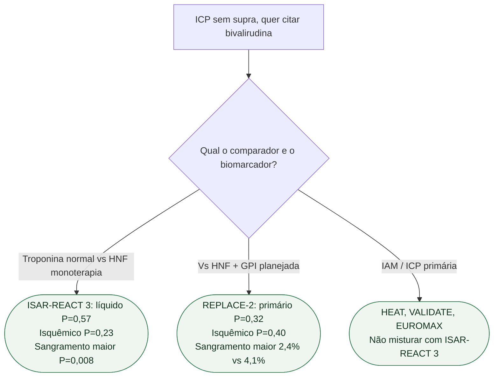

# Fluxograma: bivalirudina fora do IAM

```mermaid
flowchart TD
  R0["ICP sem supra, quer citar bivalirudina"] --> D1{"Qual o comparador e o biomarcador?"}

  D1 -->|"Troponina normal vs HNF monoterapia"| C1(["ISAR-REACT 3: líquido P=0,57<br/>Isquêmico P=0,23<br/>Sangramento maior P=0,008"])

  D1 -->|"Vs HNF + GPI planejada"| C2(["REPLACE-2: primário P=0,32<br/>Isquêmico P=0,40<br/>Sangramento maior 2,4% vs 4,1%"])

  D1 -->|"IAM / ICP primária"| C3(["HEAT, VALIDATE, EUROMAX<br/>Não misturar com ISAR-REACT 3"])

  classDef conduta fill:#eef6ef,stroke:#2f7a4f,color:#12301f;
  class C1,C2,C3 conduta;
```

## Mensagem prática

**ISAR-REACT 3 não é benefício líquido contra HNF. REPLACE-2 empata o isquêmico contra GPI planejada.**
