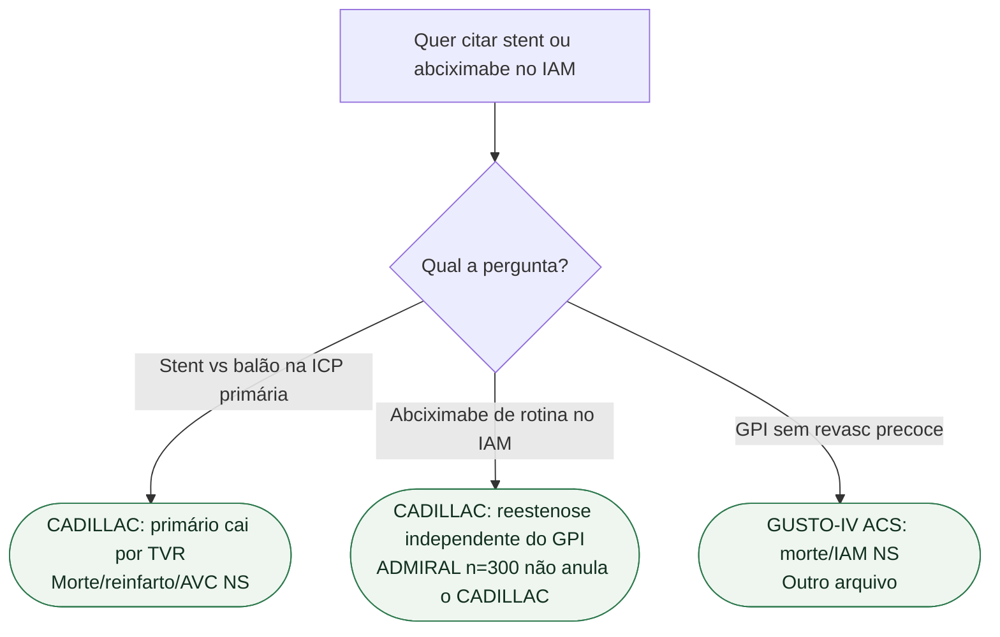

# Fluxograma: stent e GPI no IAM antigo

```mermaid
flowchart TD
  R0["Quer citar stent ou abciximabe no IAM"] --> D1{"Qual a pergunta?"}

  D1 -->|"Stent vs balão na ICP primária"| C1(["CADILLAC: primário cai por TVR<br/>Morte/reinfarto/AVC NS"])

  D1 -->|"Abciximabe de rotina no IAM"| C2(["CADILLAC: reestenose independente do GPI<br/>ADMIRAL n=300 não anula o CADILLAC"])

  D1 -->|"GPI sem revasc precoce"| C3(["GUSTO-IV ACS: morte/IAM NS<br/>Outro arquivo"])

  classDef conduta fill:#eef6ef,stroke:#2f7a4f,color:#12301f;
  class C1,C2,C3 conduta;
```

## Mensagem prática

**Stent no IAM: TVR, não mortalidade. Abciximabe rotineiro: não vender ADMIRAL contra CADILLAC.**
