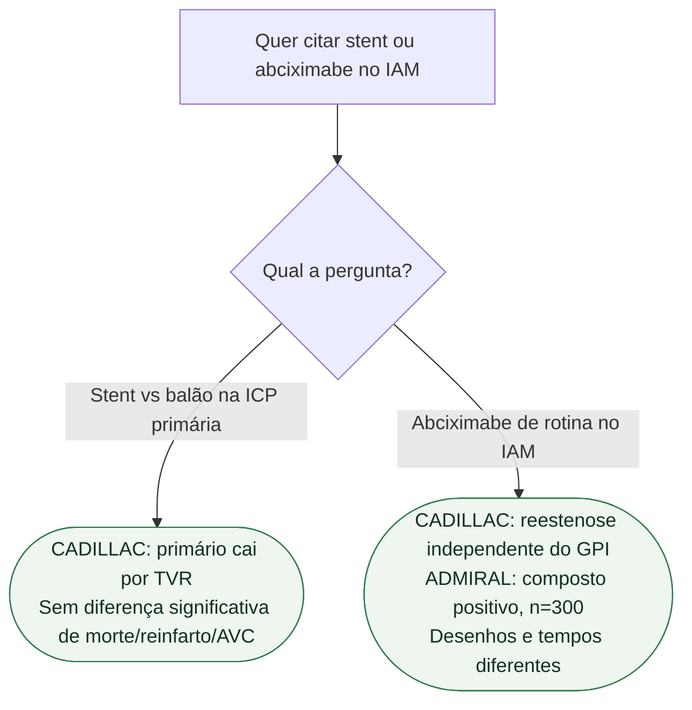

# Fluxograma: evidência histórica de stent e abciximabe no IAM

## Mensagem prática

**No CADILLAC, o benefício do composto foi impulsionado por TVR, sem redução significativa de mortalidade isolada.** O resultado positivo do ADMIRAL não deve ser descartado pelo tamanho nem transformado em recomendação rotineira contemporânea; os ensaios não são réplicas exatas.

TVR significa revascularização do vaso-alvo. No CADILLAC, o composto foi avaliado em seis meses; no ADMIRAL, o primário foi em 30 dias, com avaliação adicional aos seis meses. O fluxograma organiza a interpretação dos estudos e não determina a conduta urgente de um paciente.

## Tudo com Tudo

- [ADMIRAL: composto positivo num ensaio pequeno](/biblioteca/admiral-abciximabe-antes-do-stent-no-iam) — Liga a folha histórica do fluxograma aos números e limites do ADMIRAL; o resultado não vira indicação contemporânea automática de GPI.
