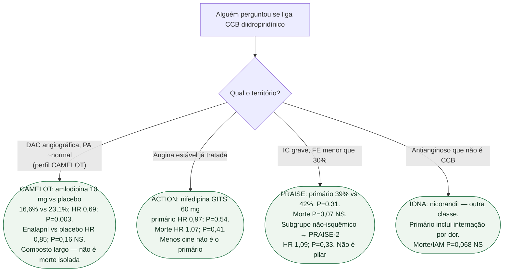

# Fluxograma: CCB diidropiridínico na DAC e na IC

## Mensagem prática

**Amlodipina ganhou um composto largo no CAMELOT; nifedipina GITS empatou no ACTION; amlodipina não reduz morte na IC (PRAISE/PRAISE-2).** CCB na ICFEr, se precisar para HAS ou angina, é tolerância — não é o quarto pilar.
