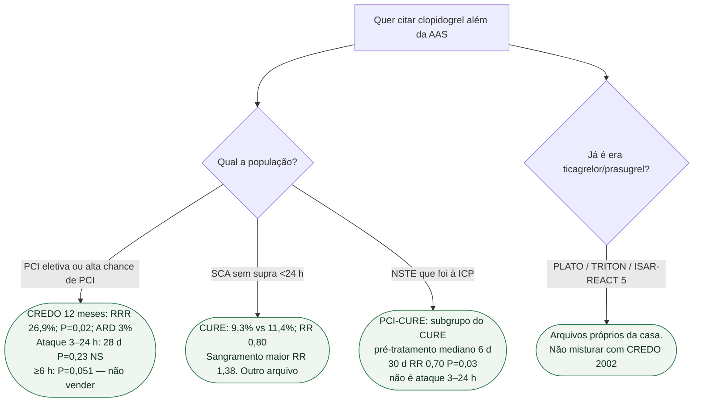

# Fluxograma: clopidogrel — CREDO, CURE ou PCI-CURE?

## Mensagem prática

**CREDO sustenta 12 meses após PCI; não sustenta o ataque 3–24 h.** CURE é SCA. PCI-CURE é o pedaço de ICP do CURE, com pré-tratamento de dias — não o loading imediato. Os P2Y12 posteriores têm arquivo próprio.
