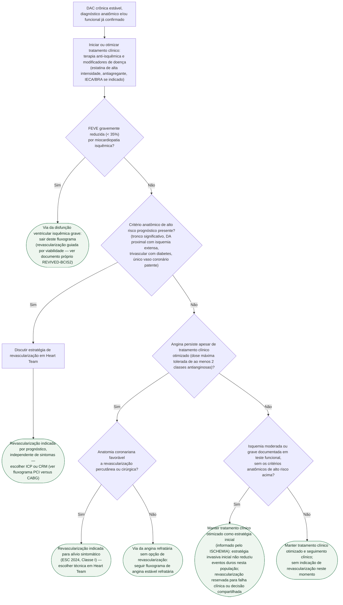

# Fluxograma: DAC crônica estável — tratamento clínico otimizado versus revascularização

O algoritmo diagnóstico da síndrome coronariana crônica (ESC 2024) termina
quando o exame confirma ou afasta DAC obstrutiva. O que ele não responde é a
pergunta seguinte, que é terapêutica: **uma vez confirmada a doença, quem
precisa de revascularização e quem pode ser tratado só clinicamente?**

O ISCHEMIA (2020) mudou a resposta para um grupo específico: pacientes com
isquemia moderada ou grave, mas **sem anatomia de alto risco** (sem lesão de
tronco relevante, sem disfunção ventricular grave), em que uma estratégia
invasiva inicial **não reduziu** morte cardiovascular, infarto ou hospitalização
por angina instável em comparação com tratamento clínico otimizado, ao longo
de seguimento mediano de 3,2 anos. A árvore abaixo organiza a decisão em duas
perguntas distintas — **prognóstico** (a anatomia obriga revascularizar,
independente de sintoma) e **sintoma** (a angina obriga revascularizar,
independente de isquemia) — e só recorre ao ISCHEMIA quando nenhuma das duas
se aplica.

## Árvore de decisão

## As duas indicações que independem uma da outra

**Indicação por prognóstico** entra primeiro na árvore porque não depende de
sintoma: tronco significativo, artéria descendente anterior proximal com
isquemia extensa, doença trivascular em diabético ou único vaso patente
remanescente são cenários em que a revascularização reduz eventos duros,
esteja o paciente sintomático ou não. É o mesmo corpo de critérios que
fundamenta a diretriz de revascularização (ESC/EACTS 2018) e que a árvore de
PCI-versus-CABG deste tema já detalha na escolha de técnica — aqui a pergunta
é anterior: **precisa revascularizar, sim ou não**, e só depois qual técnica.

**Indicação por sintoma** é independente da anterior: um paciente sem nenhum
critério anatômico de alto risco, mas com angina limitante apesar de
tratamento clínico otimizado, tem indicação de revascularização — porque o
ganho aqui é qualidade de vida, não sobrevida, e esse ganho é sustentado por
evidência própria de controle sintomático mesmo quando estudos com desfecho
duro (como o ISCHEMIA) não mostram redução de eventos.

## Onde o ISCHEMIA entra — e onde ele não entra

O ISCHEMIA só é citado no ramo em que **nenhuma das duas indicações acima se
aplica**: sem anatomia de alto risco, sem angina refratária, mas com isquemia
moderada/grave documentada em teste funcional — exatamente a população
randomizada no estudo. Nesse grupo, tratamento clínico otimizado como
estratégia inicial não foi inferiorizado por revascularização de rotina em
morte cardiovascular, infarto ou hospitalização por angina instável (16,4%
vs. 18,2% em 5 anos; diferença −1,8 ponto percentual, IC95% −4,7 a 1,0) nem em
mortalidade total (HR 1,05; IC95% 0,83–1,32). A leitura correta não é "não
revascularizar isquemia": é que a **presença isolada de isquemia moderada ou
grave, sem anatomia de alto risco e sem sintoma refratário, não obriga**
estratégia invasiva imediata.

## O que a árvore não mostra

**Pacientes com doença de tronco clinicamente significativa foram excluídos
do ISCHEMIA.** Por isso o critério de tronco aparece antes, no ramo de
prognóstico (D2), e nunca chega ao ramo informado pelo ISCHEMIA (D5) — são
populações estatisticamente diferentes, e misturá-las seria extrapolar o
estudo para fora da amostra em que foi testado.

**FEVE gravemente reduzida (< 35%) também foi critério de exclusão do
ISCHEMIA.** Por isso esse grupo sai do fluxograma já na primeira bifurcação
(D1), antes de qualquer critério anatômico ou de sintoma: a decisão de
revascularizar miocárdio isquêmico com disfunção ventricular grave segue
lógica própria (viabilidade miocárdica), tratada em documento específico da
biblioteca.

**Preferência do paciente informada** é parte da decisão em todos os ramos
não urgentes desta árvore, sobretudo no ramo do ISCHEMIA (C5): a diretriz
recomenda decisão compartilhada, com o paciente participando da escolha entre
aceitar o risco residual de sintoma sob tratamento clínico ou antecipar a
revascularização — isso não está representado como bifurcação porque não é
um critério clínico objetivo, é um eixo transversal à árvore.

**A técnica de revascularização (ICP versus CRM) não é decidida aqui.** Uma
vez que a árvore chega a C2 ou C3, a escolha entre angioplastia e cirurgia
segue o algoritmo do escore SYNTAX, diabetes e risco cirúrgico, já detalhado
no fluxograma de revascularização multiarterial e de tronco deste tema.
