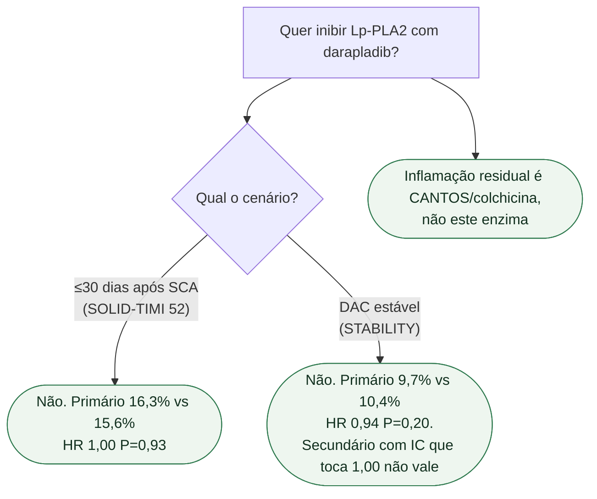

# Fluxograma: darapladib (Lp-PLA2)

```mermaid
flowchart TD
  R0["Quer inibir Lp-PLA2 com darapladib?"] --> D1{"Qual o cenário?"}

  D1 -->|"≤30 dias após SCA<br/>(SOLID-TIMI 52)"| C1(["Não. Primário 16,3% vs 15,6%<br/>HR 1,00 P=0,93"])

  D1 -->|"DAC estável<br/>(STABILITY)"| C2(["Não. Primário 9,7% vs 10,4%<br/>HR 0,94 P=0,20.<br/>Secundário com IC que toca 1,00 não vale"])

  R0 --> C3(["Inflamação residual é CANTOS/colchicina,<br/>não este enzima"])

  classDef conduta fill:#eef6ef,stroke:#2f7a4f,color:#12301f;
  class C1,C2,C3 conduta;
```

## Mensagem prática

**Dois ensaios, dois primários falhos.** Não prescrever darapladib. Não misturar com CANTOS.
