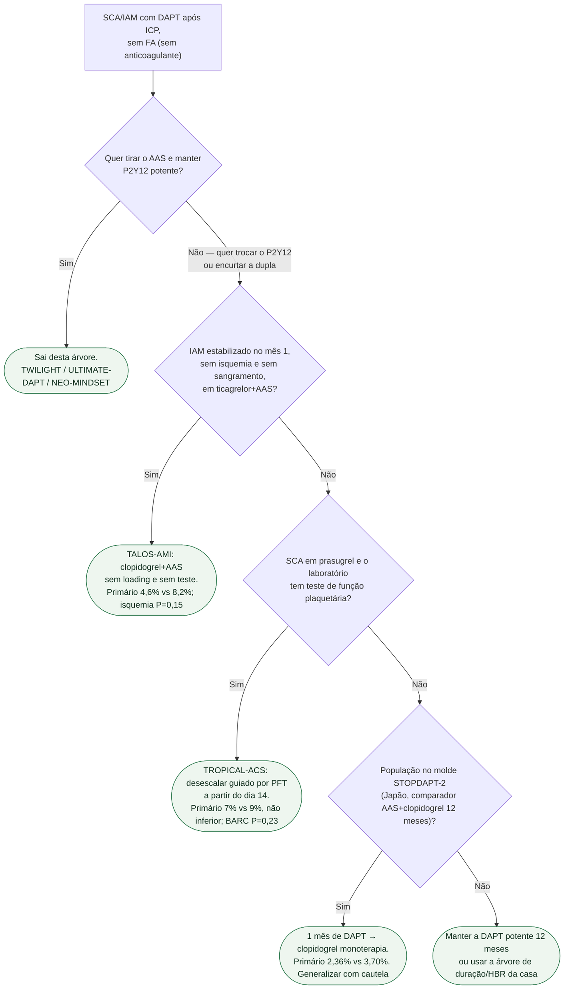

# Fluxograma: desescalonar DAPT — TALOS, TROPICAL ou STOPDAPT-2?

Não é a árvore de **quanto tempo** durar a DAPT. Aqui é **como** descer a potência depois do mês 1.

## Mensagem prática

**TALOS = troca não guiada de ticagrelor. TROPICAL = troca guiada de prasugrel. STOPDAPT-2 = tira o AAS e fica no clopidogrel (Japão).** Não misturar com TWILIGHT.
