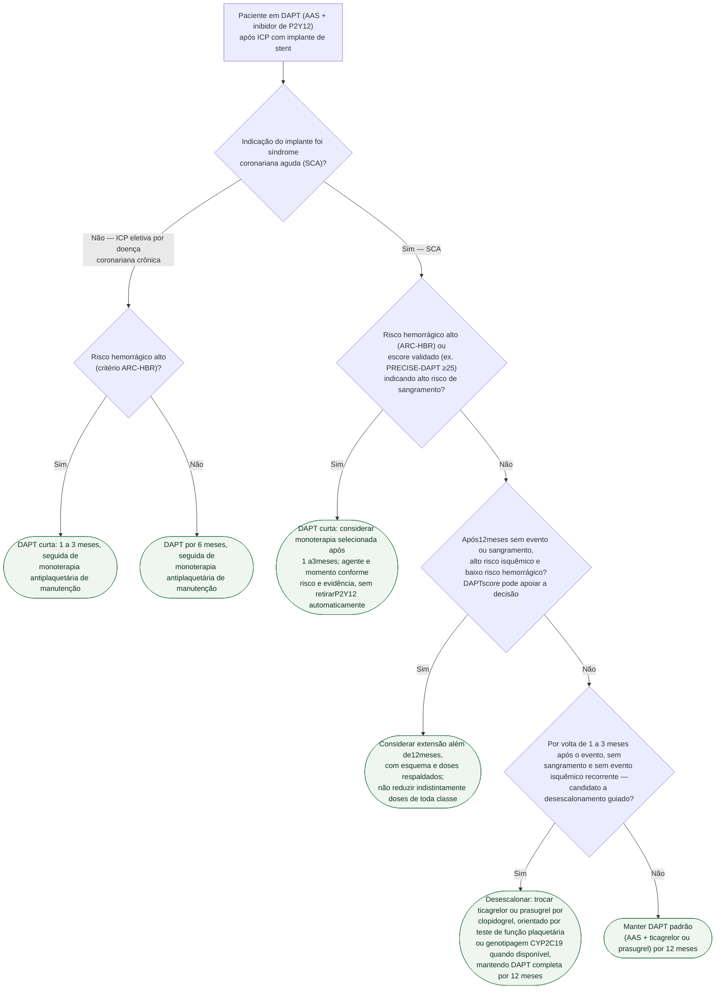

# Fluxograma: Duração e desescalonamento da DAPT após ICP

A pergunta "por quanto tempo mantenho os dois antiplaquetários?" mudou de uma
resposta fixa (12 meses para todo mundo) para uma decisão em dois eixos: **o
contexto clínico do implante** (síndrome coronariana aguda versus doença
coronariana crônica eletiva) e **o risco de sangramento versus o risco
isquêmico** de cada paciente. A diretriz ESC 2023 de SCA formalizou esse
segundo eixo com ferramentas específicas — critério ARC-HBR para sangramento,
escores como o PRECISE-DAPT e o DAPT score para apoiar a extensão ou o
encurtamento. O fluxograma abaixo segue essa lógica.

## Árvore de decisão

## O que a árvore não mostra

**Fibrilação atrial ou outra indicação de anticoagulação oral concomitante
sai completamente desta árvore.** Terapia tripla (AAS + P2Y12 + anticoagulante)
ou dupla (P2Y12 + anticoagulante, sem AAS) segue algoritmo próprio, com prazos
ainda mais curtos de exposição a três antitrombóticos — não é uma variação
desta árvore, é uma via clínica diferente.

**O DAPT score e o PRECISE-DAPT respondem perguntas diferentes e não são
intercambiáveis.** O PRECISE-DAPT (calculado no momento do implante) estima
risco de sangramento e orienta encurtar a DAPT; o DAPT score (calculado após
12 meses sem evento) estima o balanço risco-benefício de estender além de 12
meses — a árvore usa cada um no ponto de decisão correspondente.

**O acesso a teste de função plaquetária ou genotipagem CYP2C19 varia entre serviços.** Onde não
houver acesso a essas ferramentas, a diretriz também aceita desescalonamento
"não guiado" (troca empírica) em pacientes selecionados — a árvore descreve a
versão guiada como uma opção com evidência própria, sem superioridade universal, mas a ausência do teste não
impede a conduta.

**Ticagrelor em monoterapia após pelo menos um mês de DAPT**, em pacientes pós-SCA/ICP selecionados que toleraram o esquema, é estratégia recomendada na ACC/AHA2025 para reduzir sangramento. Não equivale a clopidogrel em monoterapia após um mês nem exige exclusivamente alto risco hemorrágico. A escolha considera risco isquêmico e tolerabilidade. Fonte: diretriz ACC/AHA2025 de SCA, DOI:10.1161/CIR.0000000000001309.

Evento isquêmico novo ou suspeita de trombose de stent exige avaliação imediata da causa e tratamento do evento; não se resolve apenas prolongando DAPT. Evitar desescalonamento rotineiro nos primeiros30dias após SCA. A ausência de indicação de extensão não determina automaticamente desescalonamento.
