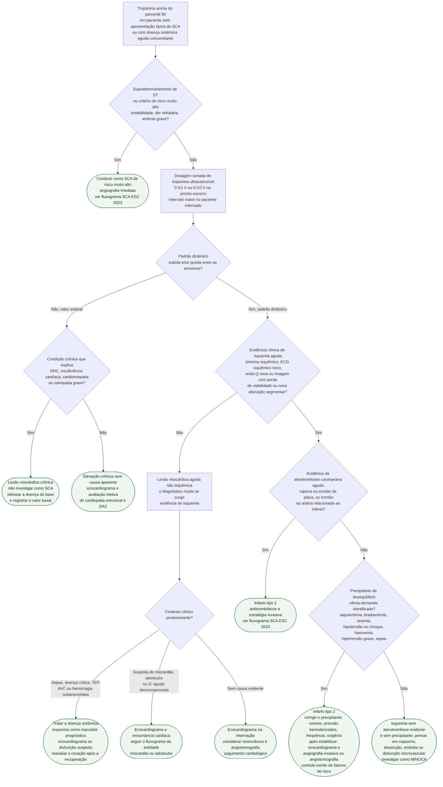

# Fluxograma: Troponina elevada fora do contexto de SCA — lesão miocárdica aguda, crônica e infarto tipo 2

Com os ensaios ultrassensíveis, troponina acima do percentil 99 aparece em sepse, insuficiência cardíaca, doença renal crônica, taquiarritmia, embolia pulmonar e em boa parte dos pacientes de terapia intensiva — e a maioria desses não tem infarto. A Quarta Definição Universal separa três entidades que costumam ser confundidas no prontuário: **lesão miocárdica crônica** (valor elevado mas estável), **lesão miocárdica aguda** (valor com subida e/ou queda, sem evidência de isquemia) e **infarto** (lesão aguda com evidência clínica de isquemia), este último dividido em tipo 1 (aterotrombose) e tipo 2 (desequilíbrio entre oferta e demanda de oxigênio). O erro em cada direção custa: rotular como "IAM" uma lesão por sepse leva a antitrombóticos e cateterismo sem indicação; rotular como "troponina da doença renal" um padrão dinâmico com dor torácica atrasa a reperfusão. A ESC 2023 dedica a seção 12.1 a esse diferencial e admite que não há intervenção farmacológica específica recomendada para o infarto tipo 2 — o que existe é o tratamento do precipitante e a investigação de doença coronariana contributiva depois da estabilização.

## Árvore de decisão

## Primeiro passo: excluir a SCA que não pode esperar

Antes de qualquer raciocínio sobre "troponina de outra causa", o ECG e o exame clínico definem se há supradesnivelamento de ST ou critério de risco muito alto (instabilidade hemodinâmica, dor refratária, arritmia ameaçadora, insuficiência cardíaca presumidamente isquêmica, alteração dinâmica de ST recorrente). Nesses casos a ESC 2023 indica angiografia imediata sem esperar resultado de troponina, e a árvore sai para o fluxograma de SCA (ver fluxograma-sindrome-coronariana-aguda-esc-2023). A ESC 2023 também é explícita: em todas as etapas do manejo da SCA suspeita, os diagnósticos diferenciais precisam ser considerados, porque são comuns, têm mecanismo e prognóstico diferentes e frequentemente exigem tratamento diferente.

## Crônica ou aguda: o padrão dinâmico decide

A definição de lesão miocárdica é a detecção de troponina acima do percentil 99 do limite superior de referência; a lesão é aguda quando há subida e/ou queda. A legenda do modelo de interpretação da Quarta Definição considera estável a variação de até 20% entre as amostras, no contexto clínico apropriado. Para a DRC, o texto diz que, se o nível elevado não muda e o momento do evento torna improvável um padrão de subida e queda, a elevação, mesmo substancial, provavelmente reflete lesão crônica — e que as mudanças seriadas são igualmente eficazes para diagnosticar infarto em pacientes com e sem doença renal. Na insuficiência cardíaca, concentrações mensuráveis existem em quase todos os pacientes, com parcela significativa acima do percentil 99, sobretudo nas formas mais graves; na descompensação aguda, troponina e ECG devem ser obtidos prontamente para identificar ou excluir isquemia como precipitante.

A ESC 2023 lembra que quatro variáveis alteram a concentração basal além da presença de infarto: idade (diferença de até 300% entre jovens e idosos saudáveis), função renal (até 300% entre extremos de TFG), tempo desde o início da dor (mais de 300%) e, em menor grau, sexo (cerca de 40%). Mesmo assim, as mudanças absolutas continuam tendo valor diagnóstico e prognóstico, e a diretriz mantém cortes uniformes como padrão até que existam calculadoras que incorporem as quatro variáveis. Os cortes do algoritmo 0 h/1 h e 0 h/2 h são específicos por ensaio e constam na Tabela S4 do suplemento da ESC 2023, não reproduzida aqui. A diretriz também pede que se evitem os termos "normal" e "anormal": o correto é "não elevada" e "elevada" em relação ao percentil 99.

## Lesão aguda sem isquemia: tratar a causa, não o número

Quando o padrão é dinâmico mas não há sintoma isquêmico, ECG isquêmico novo, onda Q nova nem imagem com perda de viabilidade ou nova alteração segmentar, o diagnóstico é lesão miocárdica aguda — e a Quarta Definição e a ESC 2023 avisam que esse rótulo pode mudar se investigações posteriores preencherem os critérios de infarto. As causas listadas pela ESC 2023 como lesão aguda são sepse, miocardite e takotsubo; como crônica, insuficiência cardíaca, cardiomiopatias e valvopatia grave. A Quarta Definição acrescenta, entre as sistêmicas, doença renal crônica, AVC e hemorragia subaracnóidea, embolia pulmonar e hipertensão pulmonar, doenças infiltrativas, quimioterápicos, doença crítica e exercício extenuante; entre as cardíacas, procedimentos de revascularização, ablação, choques de desfibrilador e contusão cardíaca. No paciente de terapia intensiva, a elevação é comum e associa-se a pior prognóstico independentemente da doença de base; parte desses casos é infarto tipo 2 por DAC subjacente e demanda aumentada, e a Quarta Definição reserva o julgamento clínico para depois da recuperação da doença crítica. A miocardite e o takotsubo têm fluxogramas próprios no acervo, e a ressonância é o exame que separa edema sem realce tardio (padrão típico do takotsubo, segundo a Quarta Definição) do padrão inflamatório.

| Mecanismo | Exemplos citados nas fontes | O que define o ramo |
|---|---|---|
| Oferta reduzida (tipo 2) | Bradiarritmia grave, insuficiência respiratória com hipoxemia grave, anemia grave, hipotensão ou choque; espasmo, disfunção microvascular, embolia coronariana, dissecção coronariana | Evidência clínica de isquemia + precipitante ou mecanismo coronariano não aterotrombótico |
| Demanda aumentada (tipo 2) | Taquiarritmia sustentada, hipertensão grave com ou sem hipertrofia ventricular | Evidência clínica de isquemia + precipitante |
| Lesão aguda não isquêmica | Sepse, miocardite, takotsubo, TEP, AVC, doença crítica, procedimentos, contusão | Padrão dinâmico sem evidência de isquemia |
| Lesão crônica | Insuficiência cardíaca, cardiomiopatias, valvopatia grave, DRC | Valor elevado estável |

## Isquemia presente: tipo 1 ou tipo 2

O infarto tipo 2 exige padrão dinâmico com pelo menos um valor acima do percentil 99, evidência de desequilíbrio entre oferta e demanda de oxigênio não relacionado a aterotrombose aguda e pelo menos um critério clínico de isquemia. A Quarta Definição descreve o cenário típico: paciente com DAC conhecida ou presumida que sofre um estressor agudo — sangramento digestivo com queda abrupta da hemoglobina, taquiarritmia sustentada com manifestação isquêmica. A descrição de placa rota com trombo na artéria relacionada ajuda a separar tipo 1 de tipo 2, mas a angiografia "nem sempre é definitiva, clinicamente indicada ou necessária" para firmar o tipo 2. Uma apresentação típica de SCA justifica tratamento inicial e investigação urgente como SCA, porém a classificação final como infarto tipo 1 exige aterotrombose aguda. Espasmo, dissecção, embolia e disfunção microvascular não se tornam tipo 1 apenas porque não há estressor sistêmico; sem aterotrombose, seguem para investigação do mecanismo não aterotrombótico.

Na conduta do tipo 2, a Quarta Definição considera aconselhável tratar no agudo o desequilíbrio — ajuste de volume, manejo pressórico, hemoderivados, controle de frequência e suporte respiratório. A ESC 2023 acrescenta que, uma vez estabilizado o paciente e tratada a doença precipitante, ecocardiograma dirigido e/ou angiografia (invasiva ou por angiotomografia) servem para identificar condições cardíacas contributivas e prognosticamente relevantes e para orientar o tratamento cardiovascular de longo prazo; e que, pela falta de evidência robusta e pela variedade de precipitantes, não há intervenção farmacológica específica recomendada — o manejo se concentra em identificar e tratar o precipitante (anemia, hipoxemia) com controle estrito dos fatores de risco. A decisão transfusional no infarto com anemia tem fluxograma próprio (ver fluxograma-anemia-e-decisao-de-transfusao-no-infarto). A ESC 2023 afirma que o tipo 2 é comum e tem prognóstico semelhante ao do tipo 1; a Quarta Definição diz que a mortalidade de curto e longo prazo é, em geral, maior que no tipo 1, pela carga de comorbidades. O consenso Delphi internacional de 2025 relata que dois terços dos pacientes com infarto tipo 2 morrem em cinco anos e alcançou concordância de 97% para otimizar o tratamento da condição causadora do desequilíbrio, de 89% para angiografia invasiva durante a internação em quem tem alta probabilidade de DAC ou isquemia em curso, de 95% para angiotomografia ou teste funcional na probabilidade intermediária e de 70% para ecocardiograma em todos.

Quando há isquemia, não há aterotrombose evidente e não há precipitante sistêmico, o mecanismo tende a ser coronariano não aterosclerótico — espasmo, dissecção espontânea, embolia, disfunção microvascular. A ESC 2023 classifica esses como causas coronarianas de tipo 2 e recomenda, para o diagnóstico de trabalho de MINOCA, seguir um algoritmo diagnóstico (Classe I, nível C), fazer ressonância após a angiografia invasiva quando o diagnóstico final não está claro (Classe I, nível B) e tratar conforme o diagnóstico final (Classe I, nível B); a ressonância identifica a causa em até 87% dos casos com diagnóstico de trabalho de MINOCA, idealmente na internação índice. O caminho segue em fluxograma-minoca-investigacao-diagnostica.

## Limitações e o que confirmar

- Os cortes de rule-in, rule-out e delta do algoritmo 0 h/1 h e 0 h/2 h são específicos por ensaio (Tabela S4 do suplemento da ESC 2023, não aberta nesta sessão); o fluxograma não os reproduz e a decisão "padrão dinâmico" deve seguir o ensaio local.
- O limite de 20% de variação para considerar o valor estável vem da legenda do modelo de interpretação da Quarta Definição e vale "no contexto clínico apropriado"; no paciente internado sem dor torácica, o intervalo entre as amostras não está padronizado nas fontes e fica a critério clínico.
- A ESC 2023 não traz tabela de recomendação com classe e nível para infarto tipo 2 ou lesão miocárdica aguda; as condutas C4, C5, C6 e C8 refletem o texto narrativo da seção 12.1 e da Quarta Definição, não recomendações classificadas.
- As porcentagens de consenso do Delphi de Taggart 2025 são opinião de especialistas, não evidência de desfecho, e a afirmação de mortalidade em cinco anos foi lida no próprio artigo sem conferência da fonte primária citada por ele.
- A ordem entre o nó de aterotrombose (D6) e o de precipitante (D7) segue a definição etiológica; em apresentação típica, a conduta inicial de SCA não deve aguardar a classificação final do mecanismo.
- A ressonância no ramo C5 e a angiotomografia no ramo C6 não têm classe de recomendação específica para lesão miocárdica aguda nas fontes lidas; derivam do texto narrativo da ESC 2023 sobre investigação após estabilização.

## Tudo com Tudo

- [Fluxograma: Síndrome Coronariana Aguda — do primeiro contato à reperfusão (ESC 2023)](/biblioteca/fluxograma-sindrome-coronariana-aguda-esc-2023)
- [Síndrome Coronariana Aguda: Diagnóstico e Manejo (ESC 2023)](/biblioteca/sindrome-coronariana-aguda-diagnostico-e-manejo-esc-2023)
- [Fluxograma: MINOCA — investigação diagnóstica do infarto sem doença coronariana obstrutiva](/biblioteca/fluxograma-minoca-investigacao-diagnostica)
- [Fluxograma: MINS — lesão miocárdica pós-operatória, vigilância com troponina e conduta](/biblioteca/fluxograma-mins-lesao-miocardica-pos-operatoria)
- [Troponina após exercício intenso no atleta: interpretação](/biblioteca/fluxograma-troponina-pos-exercicio-intenso-atleta)
- [Fluxograma: Anemia e decisão de transfusão no infarto](/biblioteca/fluxograma-anemia-e-decisao-de-transfusao-no-infarto)
- [Fluxograma: Miocardite aguda — diagnóstico, estratificação de risco e tratamento (ESC 2025)](/biblioteca/fluxograma-miocardite-aguda-esc-2025)
