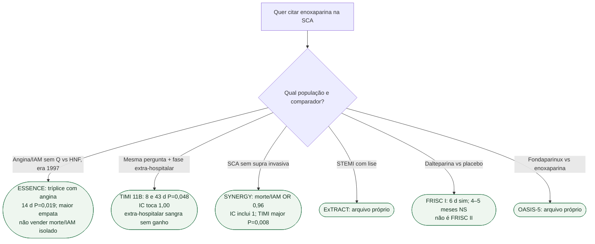

# Fluxograma: qual ensaio de enoxaparina está sendo citado?

## Mensagem prática

**Não transportar o ESSENCE para a SCA invasiva contemporânea — o SYNERGY já testou isso e empatou o isquêmico.** FRISC I não é FRISC II.
