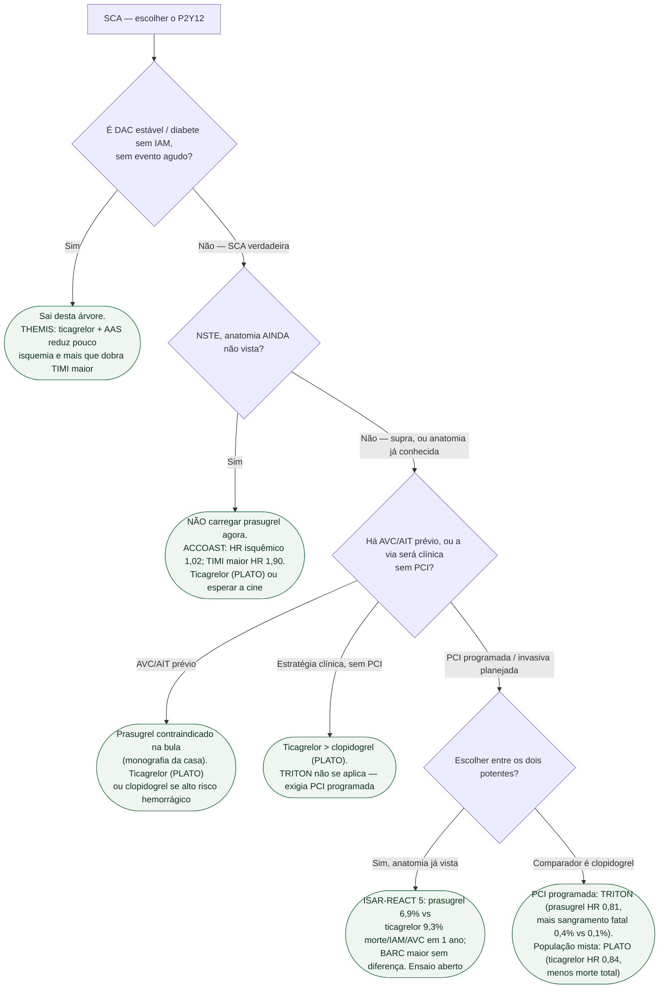

# Fluxograma: escolha do inibidor de P2Y12 na síndrome coronariana aguda

Esta árvore escolhe **qual P2Y12 no ataque**. Duração, monoterapia aos 1–3 meses e manutenção crônica (TWILIGHT, ULTIMATE-DAPT, HOST-EXAM) são documentos próprios.

## Árvore de decisão

## O que a árvore não mostra

**Clopidogrel permanece** no alto risco hemorrágico, na fibrinolise (PLATO não testou), na necessidade de DOAC (via própria) e quando o potente não está disponível. **ISAR-REACT 5 é aberto** e o timing do ataque não foi relido no PDF. **5 mg de prasugrel** em ≥75 anos / <60 kg é bula, não desfecho do TRITON neste abstract.

## Mensagem prática

**NSTE sem anatomia: não prasugrel. SCA: potente > clopidogrel (PLATO/TRITON). Entre potentes após a cine: o ISAR-REACT 5 puxa para prasugrel, com as reservas do desenho aberto. THEMIS não entra no PS.**
