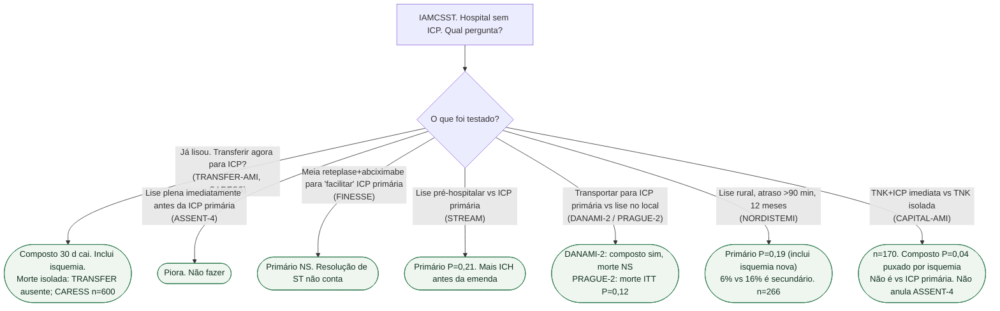

# Fluxograma: lise e depois o quê?

## Mensagem prática

**Farmacoinvasiva não é ICP facilitada.** ASSENT-4 piorou. PRAGUE-2 não ganhou mortalidade no ITT. NORDISTEMI (primário NS) e CAPITAL-AMI (n=170 vs lise sozinha) não reabrem facilitada.
