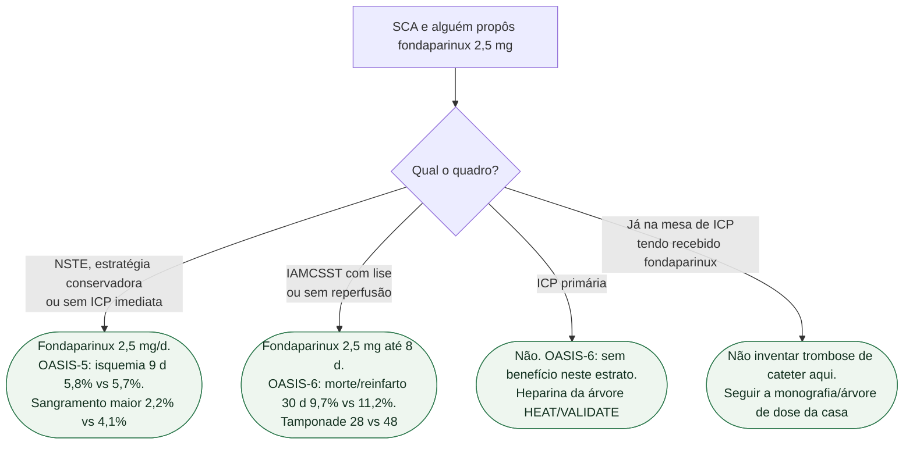

# Fluxograma: fondaparinux na SCA

## Mensagem prática

**Fondaparinux ganha onde não há ICP primária.** OASIS-5 (NSTE) e OASIS-6 (lise/sem reperfusão) são populações distintas; nenhum dos dois autoriza o uso na ICP primária.
