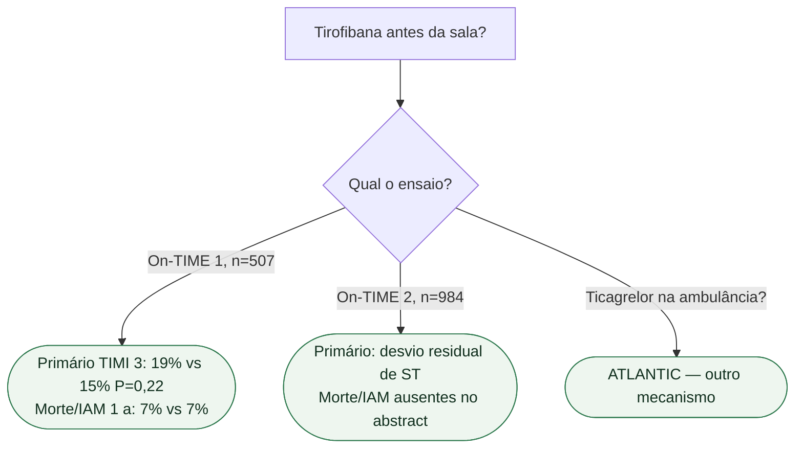

# Fluxograma: GPI no caminho da ICP primária

```mermaid
flowchart TD
  R0["Tirofibana antes da sala?"] --> D1{"Qual o ensaio?"}

  D1 -->|"On-TIME 1, n=507"| C1(["Primário TIMI 3: 19% vs 15% P=0,22<br/>Morte/IAM 1 a: 7% vs 7%"])

  D1 -->|"On-TIME 2, n=984"| C2(["Primário: desvio residual de ST<br/>Morte/IAM ausentes no abstract"])

  D1 -->|"Ticagrelor na ambulância?"| C3(["ATLANTIC — outro mecanismo"])

  classDef conduta fill:#eef6ef,stroke:#2f7a4f,color:#12301f;
  class C1,C2,C3 conduta;
```

## Mensagem prática

**On-TIME 1 não venceu o primário. On-TIME 2 venceu milímetro de ST.** Nenhum dos abstracts vende morte.
