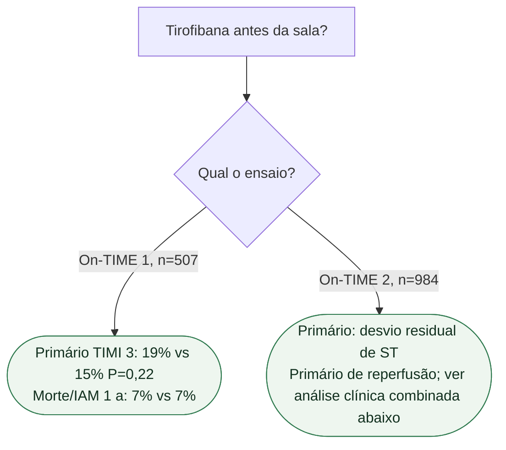

# Fluxograma: GPI no caminho da ICP primária

## Mensagem prática

O primário do On-TIME 1 foi neutro. A fase duplo-cega do On-TIME 2 avaliou reperfusão, mas não esgota o programa: a análise combinada pré-especificada de 1.398 participantes das fases aberta e duplo-cega (PMID 20510211) encontrou MACE em 30 dias de 5,8% versus 8,6% (p=0,043). A mortalidade isolada não teve redução estatisticamente significativa em 30 dias (p=0,051) ou um ano (p=0,08). Isso não demonstra benefício de mortalidade nem autoriza tirofibana pré-hospitalar rotineira no cuidado contemporâneo.

No On-TIME 1, o comparador foi tirofibana iniciada no laboratório de cateterismo; no On-TIME 2, foi ausência de tirofibana/placebo, conforme a fase. Não confundir antecipação da mesma terapia com adição de terapia.

## Tudo com Tudo

- [On-TIME 2: tirofibana pré-hospitalar e reperfusão na ICP primária](/biblioteca/on-time-2-tirofibana-pre-hospitalar-no-iamcsst-com-icp) — Liga o fluxograma ao On-TIME 2, preservando desvio de ST como primário e distinguindo TIMI 3 do On-TIME 1.
