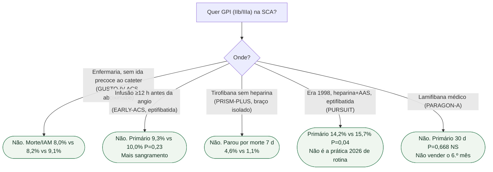

# Fluxograma: GPI na SCA

## Mensagem prática

**GPI médico de rotina não sobreviveu a GUSTO-IV e EARLY-ACS.** PRISM-PLUS proíbe tirofibana isolada. PURSUIT é o ancestral positivo, não o protocolo atual.
