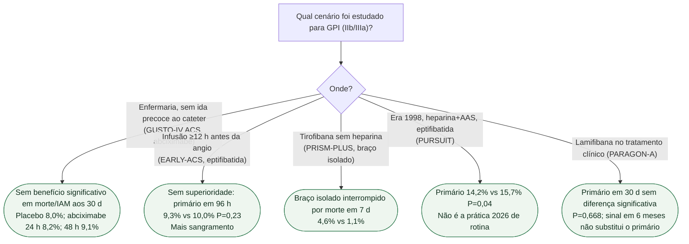

# Fluxograma: interpretação dos ensaios históricos de GPI na SCA

## Mensagem prática

**GUSTO-IV estudou tratamento sem revascularização precoce; EARLY-ACS comparou uso antecipado de rotina com uso seletivo em uma estratégia invasiva planejada.** Não são o mesmo cenário. Esses ensaios não estabelecem uso universal de GPI na prática contemporânea. A seleção de terapia na ICP deve seguir a diretriz vigente e o contexto angiográfico/hemorrágico. PRISM-PLUS não apoia tirofibana isolada sem anticoagulação no regime estudado. PURSUIT é evidência histórica e não um protocolo contemporâneo universal.

GPI significa inibidor da glicoproteína IIb/IIIa. As caixas resumem efeitos dos estudos, não são um algoritmo de prescrição ou contraindicação individual.

## Tudo com Tudo

- [PURSUIT: eptifibatida reduz morte ou IAM em 30 dias na SCA sem supra — 1,5 pp](/biblioteca/pursuit-eptifibatida-na-sca-sem-supra) — Conecta a interpretação do fluxograma ao ensaio PURSUIT, sua redução absoluta e contexto histórico de SCA sem supra.
