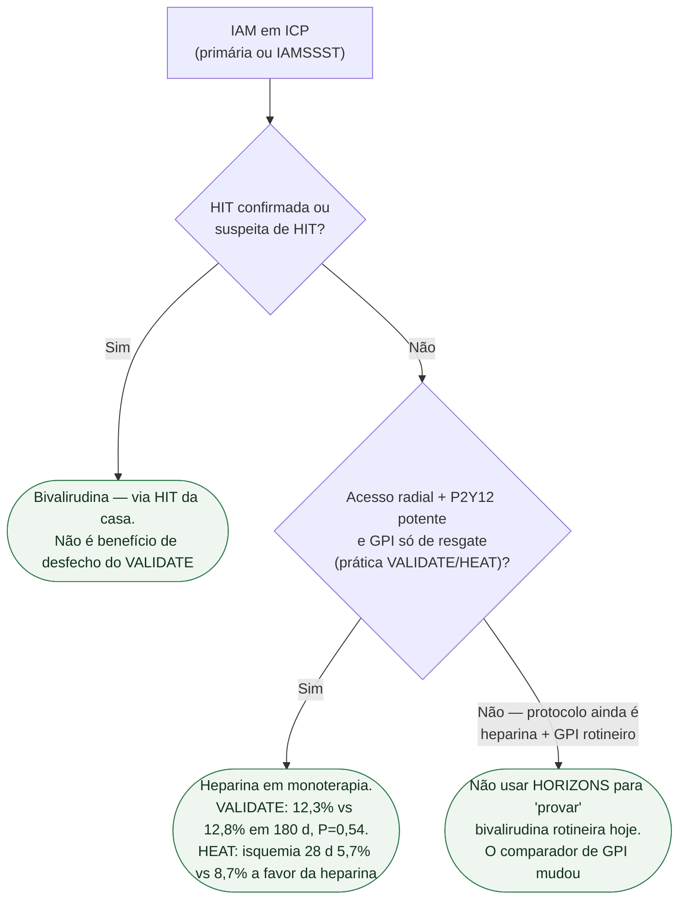

# Fluxograma: heparina ou bivalirudina na ICP do IAM

## Mensagem prática

**Fora HIT, heparina.** VALIDATE empatou; HEAT favoreceu heparina e não sangrou mais. A geração HORIZONS comparava contra heparina+GPI — outra pergunta.
