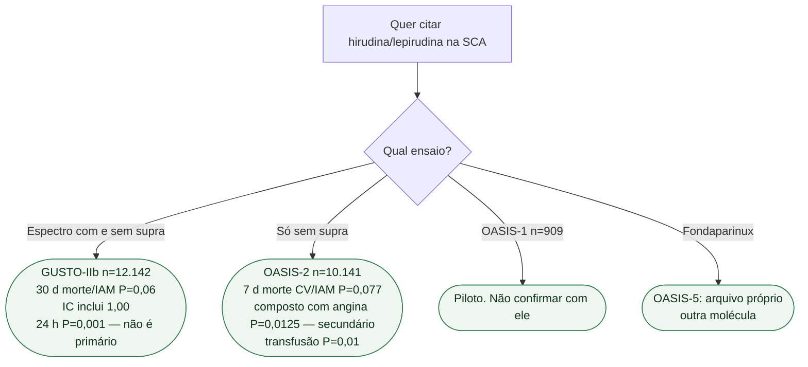

# Fluxograma: hirudina na SCA?

```mermaid
flowchart TD
  R0["Quer citar hirudina/lepirudina na SCA"] --> D1{"Qual ensaio?"}

  D1 -->|"Espectro com e sem supra"| C1(["GUSTO-IIb n=12.142<br/>30 d morte/IAM P=0,06<br/>IC inclui 1,00<br/>24 h P=0,001 — não é primário"])

  D1 -->|"Só sem supra"| C2(["OASIS-2 n=10.141<br/>7 d morte CV/IAM P=0,077<br/>composto com angina P=0,0125 — secundário<br/>transfusão P=0,01"])

  D1 -->|"OASIS-1 n=909"| C3(["Piloto. Não confirmar com ele"])

  D1 -->|"Fondaparinux"| C4(["OASIS-5: arquivo próprio<br/>outra molécula"])

  classDef conduta fill:#eef6ef,stroke:#2f7a4f,color:#12301f;
  class C1,C2,C3,C4 conduta;
```

## Mensagem prática

**Dois grandes RCTs, dois primários NS.** Não recitar o abstract que chama de superior. Hirudina saiu de cena.
