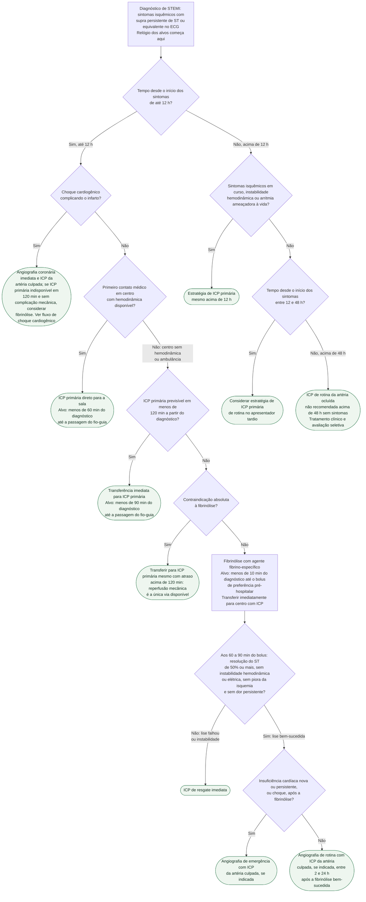

# Fluxograma: IAMCSST — estratégia de reperfusão, ICP primária vs fibrinólise (ESC 2023)

No infarto com supra de ST, a decisão que mais altera mortalidade é tomada nos
primeiros minutos após o ECG: reperfundir por ICP primária ou por fibrinólise,
e em quanto tempo. A ESC 2023 organiza essa escolha em torno de um único
relógio — **o momento do diagnóstico de STEMI**, não o da chegada ao hospital —
e de uma única pergunta para quem está fora de um centro de hemodinâmica: a ICP
primária é previsível em menos de 120 minutos? Este fluxograma cobre apenas
esse ramo. A separação STEMI × NSTE-ACS e o algoritmo de troponina estão em
`fluxograma-sindrome-coronariana-aguda-esc-2023`, e as doses dos fibrinolíticos
em `fibrinoliticos-stemi-tenecteplase-alteplase-arvore-de-dose`.

## Árvore de decisão

## O relógio e os três alvos de tempo

Todos os alvos são contados a partir do **diagnóstico de STEMI** — o momento em
que o ECG é interpretado como supra de ST ou equivalente —, e não da chegada à
porta do hospital. A figura da diretriz fixa três metas conforme o local do
primeiro contato médico:

| Local do primeiro contato | Estratégia | Alvo de tempo |
|---|---|---|
| Centro com hemodinâmica | ICP primária | Menos de 60 min do diagnóstico até a passagem do fio-guia |
| Centro sem hemodinâmica ou ambulância, ICP previsível em menos de 120 min | Transferência imediata para ICP primária | Menos de 90 min do diagnóstico até a passagem do fio-guia |
| Centro sem hemodinâmica ou ambulância, ICP não previsível em menos de 120 min | Fibrinólise | Menos de 10 min do diagnóstico até o bolus do fibrinolítico |

A reperfusão é recomendada em todo STEMI com sintomas de até 12 h (Classe I,
nível A), e a ICP primária é preferida à fibrinólise sempre que o tempo previsto
do diagnóstico à ICP for inferior a 120 min (Classe I, nível A). O paciente
transferido vai direto à sala de hemodinâmica, sem passar pela emergência ou
pela unidade coronariana (Classe I, nível B). O no-reflow dentro da sala tem
fluxo próprio — ver `fluxograma-manejo-do-no-reflow-na-icp-primaria`.

## O ramo da fibrinólise

Quando a ICP primária não pode ser realizada em menos de 120 min, a fibrinólise
é recomendada até 12 h do início dos sintomas, em pacientes sem
contraindicação (Classe I, nível A). Ela deve começar o mais cedo possível após
o diagnóstico, de preferência ainda no ambiente pré-hospitalar, com meta de
menos de 10 min até o bolus (Classe I, nível A), usando agente fibrino-específico
— tenecteplase, alteplase ou reteplase (Classe I, nível B). Em maiores de
75 anos, deve-se considerar meia dose de tenecteplase (Classe IIa, nível B).
A dose por peso está em `fibrinoliticos-stemi-tenecteplase-alteplase-arvore-de-dose`.

Co-terapia: aspirina e clopidogrel são recomendados (Classe I, nível A) — na
fibrinólise, a dose inicial de clopidogrel é de 300 mg, reduzida a 75 mg acima
de 75 anos —, e a anticoagulação é mantida até a revascularização ou pela
duração da internação, até 8 dias (Classe I, nível A), com enoxaparina
intravenosa seguida de subcutânea como agente preferido (Classe I, nível A). Detalhes em
`posologia-de-antiagregantes-e-anticoagulantes-na-sindrome-coronariana-aguda-esc-2023`.

| Contraindicações à fibrinólise (Tabela S11) | |
|---|---|
| Absolutas | Hemorragia intracraniana prévia ou AVC de origem desconhecida; AVC isquêmico nos últimos 6 meses; lesão, neoplasia ou malformação arteriovenosa do SNC; trauma, cirurgia ou traumatismo craniano importantes no último mês; sangramento digestivo no último mês; distúrbio hemorrágico conhecido; dissecção de aorta; punção não compressível nas últimas 24 h |
| Relativas | AIT nos últimos 6 meses; anticoagulação oral; gestação ou primeira semana pós-parto; hipertensão refratária acima de 180/110 mmHg; doença hepática avançada; endocardite infecciosa; úlcera péptica ativa; reanimação prolongada ou traumática |

A árvore só desvia para a ICP primária tardia diante de contraindicação
absoluta; com contraindicação relativa, a decisão é individual.

## Depois do bolus: resgate ou rotina

A fibrinólise não encerra a decisão — todo paciente é transferido de imediato
para um centro com ICP (Classe I, nível A), e o que acontece lá depende da
resposta ao trombolítico:

| Situação aos 60 a 90 min do bolus | Conduta | Classe |
|---|---|---|
| Resolução do ST inferior a 50%, ou instabilidade hemodinâmica ou elétrica, isquemia em piora, dor persistente | ICP de resgate imediata | I, nível A |
| Insuficiência cardíaca nova ou persistente, ou choque, após a lise | Angiografia de emergência com ICP da artéria culpada, se indicada | I, nível A |
| Lise bem-sucedida, sem instabilidade | Angiografia com ICP da artéria culpada, se indicada, entre 2 e 24 h | I, nível A |

A diretriz chama essa combinação de estratégia farmacoinvasiva: fibrinólise
seguida de ICP de resgate quando falha, ou de ICP precoce de rotina quando
funciona. O erro clássico é tratar a lise bem-sucedida como conduta definitiva
e não agendar a angiografia dentro da janela de 2 a 24 h.

## Apresentador tardio: acima de 12 h

Acima de 12 h do início dos sintomas, a estratégia de ICP primária continua
recomendada na presença de sintomas isquêmicos em curso, instabilidade
hemodinâmica ou arritmias ameaçadoras à vida (Classe I, nível C). Sem esses
achados, a diretriz separa duas janelas: entre 12 e 48 h, uma estratégia de ICP
primária de rotina deve ser considerada (Classe IIa, nível B); acima de 48 h,
a ICP de rotina de uma artéria relacionada ao infarto ocluída não é recomendada
em pacientes sem sintomas persistentes (Classe III, nível A). A fibrinólise não
entra nesse ramo — sua recomendação vale apenas dentro das primeiras 12 h.

## Choque cardiogênico

O primeiro nó isola o choque porque ele suspende a lógica do atraso: no choque
que complica a SCA, a angiografia imediata com ICP da artéria culpada é
recomendada (Classe I, nível B), com cirurgia de emergência se a ICP não for
viável ou falhar (Classe I, nível B). A fibrinólise só deve ser considerada
quando a ICP primária não está disponível em 120 min do diagnóstico e as
complicações mecânicas foram afastadas (Classe IIa, nível C). Ver
`choque-cardiogenico-na-sindrome-coronariana-aguda-culprit-shock-e-iabp-shock-ii`.

## Limitações e o que confirmar

- As classes e níveis de evidência foram extraídos do slide set oficial da
  ESC e, na verificação, confrontados com as Tabelas de Recomendação 3, 4, 7
  e 9 e a Figura 7 do PDF integral do artigo (Eur Heart J 2023;44:3720),
  obtido no repositório institucional repisalud.isciii.es.
- O ramo "contraindicação absoluta à fibrinólise → transferir para ICP primária
  mesmo acima de 120 min" é dedução do princípio de que a reperfusão é
  recomendada em todo STEMI de até 12 h: a diretriz não traz uma recomendação
  literal para esse cenário, e o atraso aceitável não é quantificado.
- A conduta acima de 48 h sem sintomas resume a recomendação negativa da
  diretriz; o seguimento do paciente estável segue a síndrome coronariana crônica.
- Os alvos de 60, 90 e 10 min vêm da figura da diretriz, como metas de sistema,
  e não de recomendações com classe própria.
- Não cobre acesso vascular, lesões não culpadas nem antitrombótica periprocedimento.

## Tudo com Tudo

- [Fluxograma: Síndrome Coronariana Aguda — do primeiro contato à reperfusão (ESC 2023)](/biblioteca/fluxograma-sindrome-coronariana-aguda-esc-2023)
- [STEMI: Estratégia de Reperfusão (ESC 2023)](/biblioteca/stemi-estrategia-de-reperfusao-esc-2023)
- [Fibrinolíticos no STEMI — tenecteplase e alteplase, árvore de dose](/biblioteca/fibrinoliticos-stemi-tenecteplase-alteplase-arvore-de-dose)
- [Posologia de antiagregantes e anticoagulantes na síndrome coronariana aguda (ESC 2023)](/biblioteca/posologia-de-antiagregantes-e-anticoagulantes-na-sindrome-coronariana-aguda-esc-2023)
- [Choque Cardiogênico na Síndrome Coronariana Aguda: CULPRIT-SHOCK e IABP-SHOCK II](/biblioteca/choque-cardiogenico-na-sindrome-coronariana-aguda-culprit-shock-e-iabp-shock-ii)
- [Fluxograma: Manejo do no-reflow durante a ICP primária](/biblioteca/fluxograma-manejo-do-no-reflow-na-icp-primaria)
