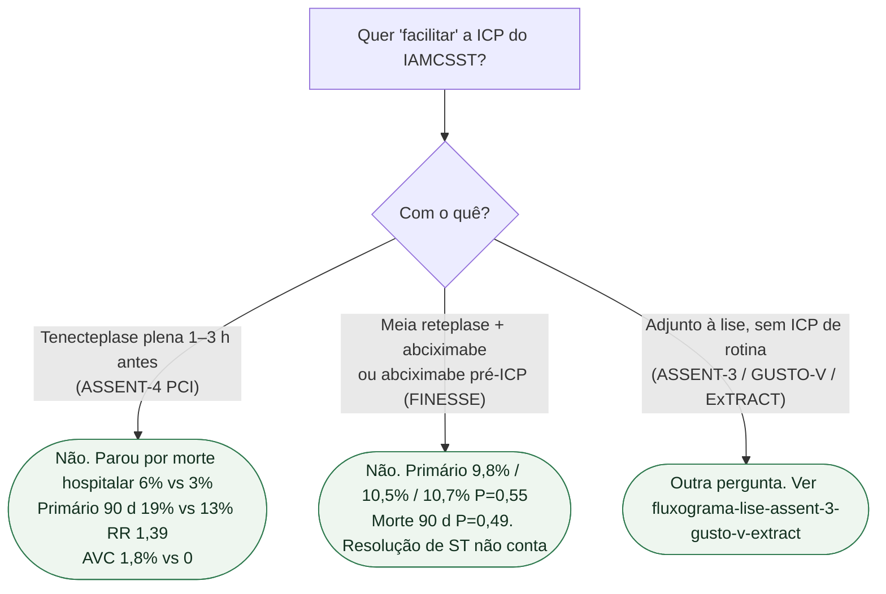

# Fluxograma: não facilitar a ICP primária com lise

## Mensagem prática

**ICP primária não se facilita com lise plena (faz mal) nem com GPI/meia-lise (não ganha).** Resolução de ST no FINESSE não substitui o primário nulo.
